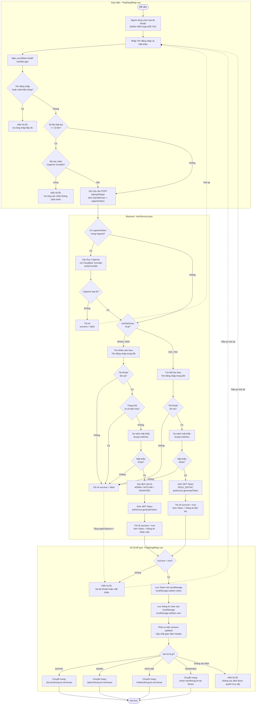

# Sơ đồ Activity Diagram - Chức năng Đăng Nhập

Dựa trên mã nguồn frontend (`PopDangNhap.vue`) và backend (`AuthService.java`), dưới đây là sơ đồ hoạt động chi tiết cho luồng đăng nhập.

### Giải thích các điểm quan trọng:

1. **Chọn loại tài khoản (Tab):**
   - Giao diện có 2 tab: **Nhân viên An Yên** và **Đối tác**.
   - Người dùng chọn tab tương ứng trước khi đăng nhập. Frontend sẽ gửi thêm trường `loaiTaiKhoan = "NHAN_VIEN"` hoặc `"DOI_TAC"` lên Backend để Backend biết cần tìm trong bảng nào.

2. **Chống Bot bằng Captcha (Turnstile):**
   - Sau **10 lần đăng nhập thất bại**, giao diện tự động hiển thị ô xác nhận Captcha của **Cloudflare Turnstile**.
   - Backend cũng tự kiểm tra lại Captcha nếu Frontend gửi kèm token, bằng cách gọi lên API của Cloudflare để xác minh.

3. **Xác thực mật khẩu BCrypt:**
   - Mật khẩu trong Database được lưu dưới dạng **mã hóa BCrypt**. Backend dùng hàm `passwordEncoder.matches(matKhauNguoiDung, matKhauTrongDB)` để so sánh, không bao giờ so sánh trực tiếp bằng chuỗi thô.

4. **JWT Token:**
   - Sau khi xác thực thành công, Backend sinh ra một chuỗi **JWT Token** mã hóa bên trong đó có: ID, tên đăng nhập và vai trò (`ROLE_ADMIN`, `ROLE_HOTLINE`, `ROLE_NHANVIEN`, `ROLE_DOITAC`).
   - Frontend lưu Token vào `localStorage`. Từ đó về sau, mọi request API khác đều gắn Token này vào Header `Authorization: Bearer <token>`.

5. **Điều hướng theo vai trò:**
   - Sau khi đăng nhập thành công, Frontend đọc trường `vaiTroChiTiet` từ response và tự động điều hướng người dùng đến đúng trang Dashboard tương ứng với vai trò của họ (DOITAC, ADMIN, HOTLINE, NHANVIEN).
