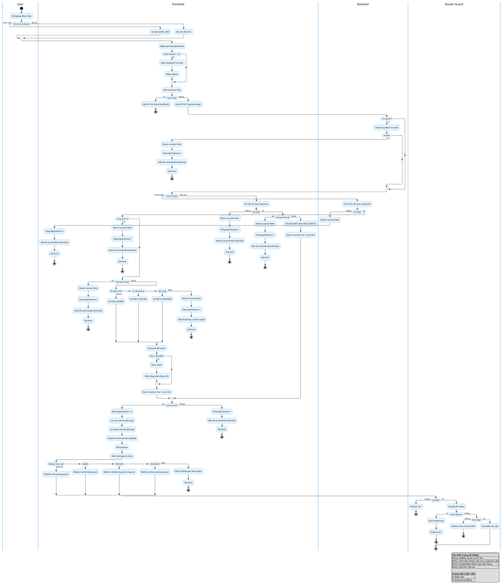

# Activity Diagram - Quy Trình Đăng Nhập

## Mermaid Activity Diagram

```mermaid
flowchart TD
    Start((Start)) --> OpenLogin[Mở popup đăng nhập]
    OpenLogin --> SelectTab{Chọn loại tài khoản}
    
    SelectTab -->|Nhân viên| SetTabNV[Set tab: NHAN_VIEN]
    SelectTab -->|Đối tác| SetTabDT[Set tab: DOI_TAC]
    
    SetTabNV --> InputInfo[Nhập username/password]
    SetTabDT --> InputInfo
    
    InputInfo --> CheckFailures{Số lần thất bại >= 10?}
    
    CheckFailures -->|Có| ShowCaptcha[Hiện Cloudflare Turnstile]
    ShowCaptcha --> InputCaptcha[Nhập captcha]
    InputCaptcha --> ValidateInput
    
    CheckFailures -->|Không| ValidateInput[Kiểm tra input rỗng]
    
    ValidateInput -->|Input rỗng| ShowErrorInput[Hiện lỗi: Vui lòng nhập đầy đủ]
    ShowErrorInput --> InputInfo
    
    ValidateInput -->|Input hợp lệ| CallAPI[Gọi API POST /api/auth/login]
    
    CallAPI --> BackendAuth{Backend xử lý}
    
    BackendAuth --> ValidateCaptcha{Có captcha?}
    ValidateCaptcha -->|Có| VerifyTurnstile[Verify Cloudflare Turnstile]
    VerifyTurnstile -->|Invalid| ReturnFailCaptcha[Return success=false]
    ReturnFailCaptcha --> FrontendError
    
    ValidateCaptcha -->|Không| CheckAccountType{Loại tài khoản}
    
    CheckAccountType -->|NHAN_VIEN| FindNV[Tìm nhân viên theo username]
    CheckAccountType -->|DOI_TAC| FindDT[Tìm đối tác theo username]
    
    FindNV --> NVExists{Tìm thấy?}
    NVExists -->|Không| ReturnFailNV[Return success=false]
    ReturnFailNV --> FrontendError
    
    NVExists -->|Có| CheckNVStatus{Trạng thái = 0?}
    CheckNVStatus -->|Có| ReturnFailStatus[Return success=false]
    ReturnFailStatus --> FrontendError
    
    CheckNVStatus -->|Không| CheckPasswordNV{Password đúng?}
    CheckPasswordNV -->|Sai| ReturnFailPassNV[Return success=false]
    ReturnFailPassNV --> FrontendError
    
    CheckPasswordNV -->|Đúng| DetermineRole{Xác định role}
    
    DetermineRole -->|Admin| SetRoleAdmin[Set ROLE_ADMIN]
    DetermineRole -->|Tư vấn/Hotline| SetRoleHotline[Set ROLE_HOTLINE]
    DetermineRole -->|Bán hàng| SetRoleNV[Set ROLE_NHANVIEN]
    DetermineRole -->|Khác| ReturnFailRole[Return success=false]
    ReturnFailRole --> FrontendError
    
    SetRoleAdmin --> GenerateTokenNV
    SetRoleHotline --> GenerateTokenNV
    SetRoleNV --> GenerateTokenNV
    
    GenerateTokenNV[Generate JWT token] --> CheckHotline{Role = HOTLINE?}
    CheckHotline -->|Có| MarkOnline[Mark online]
    MarkOnline --> AssignSessions[Phân công phiên đang chờ]
    AssignSessions --> ReturnSuccessNV
    CheckHotline -->|Không| ReturnSuccessNV
    
    ReturnSuccessNV[Return success=true + user info] --> FrontendSuccess
    
    FindDT --> DTExists{Tìm thấy?}
    DTExists -->|Không| ReturnFailDT[Return success=false]
    ReturnFailDT --> FrontendError
    
    DTExists -->|Có| CheckPasswordDT{Password đúng?}
    CheckPasswordDT -->|Sai| ReturnFailPassDT[Return success=false]
    ReturnFailPassDT --> FrontendError
    
    CheckPasswordDT -->|Đúng| GenerateTokenDT[Generate JWT token ROLE_DOITAC]
    GenerateTokenDT --> ReturnSuccessDT[Return success=true + user info]
    ReturnSuccessDT --> FrontendSuccess
    
    FrontendSuccess{Frontend xử lý response}
    FrontendSuccess -->|success=true| ResetFailures[Reset loginFailures = 0]
    ResetFailures --> SaveUser[Lưu user vào localStorage]
    SaveUser --> SaveToken[Lưu token vào localStorage]
    SaveToken --> DispatchEvent[Dispatch event session-updated]
    DispatchEvent --> CloseModal[Đóng popup]
    CloseModal --> ShowSuccessMsg[Hiện message xin chào]
    ShowSuccessMsg --> RedirectRole{Redirect theo role}
    
    RedirectRole -->|DOITAC| RouteDOI_TAC[/doi-tac/tong-quan]
    RedirectRole -->|ADMIN| RouteADMIN[/admin/tong-quan]
    RedirectRole -->|HOTLINE| RouteHOTLINE[/hotline/quan-ly-cong-viec]
    RedirectRole -->|NHANVIEN| RouteNHANVIEN[/nhan-vien/tong-quan]
    RedirectRole -->|Khác| ShowErrorRole[Hiện lỗi không xác định quyền]
    ShowErrorRole --> ClearForm
    
    RouteDOI_TAC --> RouterGuard{Router Guard}
    RouteADMIN --> RouterGuard
    RouteHOTLINE --> RouterGuard
    RouteNHANVIEN --> RouterGuard
    
    RouterGuard --> CheckToken{Có token?}
    CheckToken -->|Không| RedirectHome[Redirect về /]
    RedirectHome --> End((End))
    
    CheckToken -->|Có| DecodeToken[Decode JWT token]
    DecodeToken --> CheckExpired{Token hết hạn?}
    CheckExpired -->|Có| ClearStorage[Xóa localStorage]
    ClearStorage --> RedirectHome
    
    CheckExpired -->|Không| CheckRoleMatch{Role khớp?}
    CheckRoleMatch -->|Không| RedirectByRole[Redirect theo role từ token]
    RedirectByRole --> End
    
    CheckRoleMatch -->|Có| AllowAccess[Cho phép truy cập]
    AllowAccess --> End
    
    FrontendError -->|success=false| IncrementFailures[Tăng loginFailures++]
    IncrementFailures --> ShowErrorMsg[Hiện lỗi sai tài khoản/mật khẩu]
    ShowErrorMsg --> ClearForm[Xóa form]
    ClearForm --> End
    
    %% Swimlanes
    subgraph User
        OpenLogin
        SelectTab
        InputInfo
        InputCaptcha
    end
    
    subgraph Frontend
        SetTabNV
        SetTabDT
        CheckFailures
        ShowCaptcha
        ValidateInput
        ShowErrorInput
        CallAPI
        FrontendSuccess
        ResetFailures
        SaveUser
        SaveToken
        DispatchEvent
        CloseModal
        ShowSuccessMsg
        RedirectRole
        RouteDOI_TAC
        RouteADMIN
        RouteHOTLINE
        RouteNHANVIEN
        ShowErrorRole
        ClearForm
        IncrementFailures
        ShowErrorMsg
    end
    
    subgraph Backend
        BackendAuth
        ValidateCaptcha
        VerifyTurnstile
        ReturnFailCaptcha
        CheckAccountType
        FindNV
        FindDT
        NVExists
        DTExists
        CheckNVStatus
        CheckPasswordNV
        CheckPasswordDT
        DetermineRole
        SetRoleAdmin
        SetRoleHotline
        SetRoleNV
        ReturnFailRole
        GenerateTokenNV
        CheckHotline
        MarkOnline
        AssignSessions
        ReturnSuccessNV
        ReturnFailNV
        ReturnFailStatus
        ReturnFailPassNV
        GenerateTokenDT
        ReturnSuccessDT
        ReturnFailDT
        ReturnFailPassDT
    end
    
    subgraph Router_Guard
        RouterGuard
        CheckToken
        DecodeToken
        CheckExpired
        CheckRoleMatch
        AllowAccess
        ClearStorage
        RedirectHome
        RedirectByRole
    end
    
    %% Styling
    classDef startend fill:#e1f5e1,stroke:#4caf50,stroke-width:2px
    classDef process fill:#e3f2fd,stroke:#2196f3,stroke-width:2px
    classDef decision fill:#fff3e0,stroke:#ff9800,stroke-width:2px
    classDef error fill:#ffebee,stroke:#f44336,stroke-width:2px
    classDef success fill:#f1f8e9,stroke:#8bc34a,stroke-width:2px
    
    class Start,End startend
    class SetTabNV,SetTabDT,InputInfo,InputCaptcha,ValidateInput,CallAPI,ResetFailures,SaveUser,SaveToken,DispatchEvent,CloseModal,ShowSuccessMsg,RouteDOI_TAC,RouteADMIN,RouteHOTLINE,RouteNHANVIEN,ClearForm,IncrementFailures,ShowErrorMsg process
    class CheckFailures,BackendAuth,ValidateCaptcha,VerifyTurnstile,CheckAccountType,FindNV,FindDT,NVExists,DTExists,CheckNVStatus,CheckPasswordNV,CheckPasswordDT,DetermineRole,CheckHotline,FrontendSuccess,RedirectRole,RouterGuard,CheckToken,DecodeToken,CheckExpired,CheckRoleMatch decision
    class ShowErrorInput,ShowCaptcha,ReturnFailCaptcha,ReturnFailNV,ReturnFailStatus,ReturnFailPassNV,ReturnFailRole,ReturnFailDT,ReturnFailPassDT,ShowErrorRole,FrontendError error
    class MarkOnline,AssignSessions,GenerateTokenNV,GenerateTokenDT,ReturnSuccessNV,ReturnSuccessDT,AllowAccess success
```

## PlantUML Activity Diagram



## Mô Tả Quy Trình Đăng Nhập

### **Luồng Chính (Happy Path)**

**1. Frontend - User Input:**
- User mở popup đăng nhập
- Chọn loại tài khoản: Nhân viên hoặc Đối tác
- Nhập username và password
- Nếu thất bại >= 10 lần: Hiện Cloudflare Turnstile captcha
- Validate input không rỗng

**2. Frontend - Gọi API:**
- Gọi POST `/api/auth/login` với payload:
  - `tenDangNhap`: username
  - `matKhau`: password
  - `loaiTaiKhoan`: NHAN_VIEN hoặc DOI_TAC
  - `captchaToken`: token từ Turnstile (nếu có)

**3. Backend - Xử lý Nhân viên:**
- Validate captcha (nếu có)
- Tìm nhân viên theo `tenDangNhap`
- Kiểm tra trạng thái (không phải 0 - nghỉ việc)
- Verify password với `PasswordEncoder`
- Xác định role cụ thể:
  - `VAI_TRO_ADMIN (1)` → `ROLE_ADMIN`
  - `VAI_TRO_TU_VAN (3)` hoặc `VAI_TRO_HOTLINE (4)` → `ROLE_HOTLINE`
  - `VAI_TRO_BAN_HANG (2)` → `ROLE_NHANVIEN`
- Generate JWT token với `userId`, `username`, `role`
- Nếu role = HOTLINE: Mark online và phân công phiên đang chờ
- Return `success=true` với thông tin user

**4. Backend - Xử lý Đối tác:**
- Tìm đối tác theo `tenDangNhap`
- Verify password
- Generate JWT token với `ROLE_DOITAC`
- Return `success=true` với thông tin đối tác

**5. Frontend - Xử lý Success:**
- Reset `loginFailures = 0`
- Lưu user vào `localStorage`
- Lưu token vào `localStorage`
- Dispatch event `session-updated`
- Đóng popup
- Hiện message "Xin chào {hoTen}"
- Redirect theo role:
  - `DOITAC` → `/doi-tac/tong-quan`
  - `ADMIN` → `/admin/tong-quan`
  - `HOTLINE` → `/hotline/quan-ly-cong-viec`
  - `NHANVIEN` → `/nhan-vien/tong-quan`

**6. Router Guard:**
- Kiểm tra có token
- Decode JWT token
- Kiểm tra token hết hạn (`exp < now`)
- Kiểm tra role khớp với route
- Cho phép truy cập

### **Luồng Exception**

**Input rỗng:**
- Hiện lỗi "Vui lòng nhập đầy đủ tài khoản và mật khẩu"
- User nhập lại

**Captcha invalid:**
- Backend verify Turnstile thất bại
- Return `success=false`
- Frontend hiện lỗi

**Không tìm thấy user:**
- Backend không tìm thấy username
- Return `success=false`
- Frontend tăng `loginFailures`
- Hiện lỗi "Sai tài khoản, mật khẩu hoặc không có quyền truy cập"

**User nghỉ việc (trạng thái = 0):**
- Backend kiểm tra trạng thái nhân viên
- Return `success=false`
- Frontend hiện lỗi

**Sai password:**
- Backend verify password thất bại
- Return `success=false`
- Frontend tăng `loginFailures`
- Hiện lỗi

**Role không tồn tại:**
- Backend không xác định được role
- Return `success=false`
- Frontend hiện lỗi "Không xác định được quyền truy cập"

**Token hết hạn:**
- Router guard kiểm tra `exp < now`
- Xóa localStorage
- Redirect về trang chủ

**Role không khớp:**
- Router guard kiểm tra role từ token vs route
- Redirect theo role từ token

### **Các Security Features**

1. **Cloudflare Turnstile Captcha:**
   - Hiện sau 10 lần thất bại
   - Verify với Cloudflare API
   - Bảo vệ brute force

2. **Password Encoding:**
   - Sử dụng BCryptPasswordEncoder
   - Không lưu plain text

3. **JWT Token:**
   - Contain userId, username, role
   - Có expiration time
   - Verify mỗi request

4. **Role-based Access Control:**
   - 4 roles chính: ADMIN, HOTLINE, NHANVIEN, DOITAC
   - Router guard kiểm tra role
   - Redirect theo role

5. **Account Status Check:**
   - Kiểm tra trạng thái nhân viên (nghỉ việc)
   - Không cho đăng nhập nếu không hoạt động

### **LocalStorage Keys**

- `user`: JSON string của user info
- `token`: JWT token
- `loaiTaiKhoan`: NHAN_VIEN hoặc DOI_TAC
- `tenDangNhap`: username
- `id`: userId
