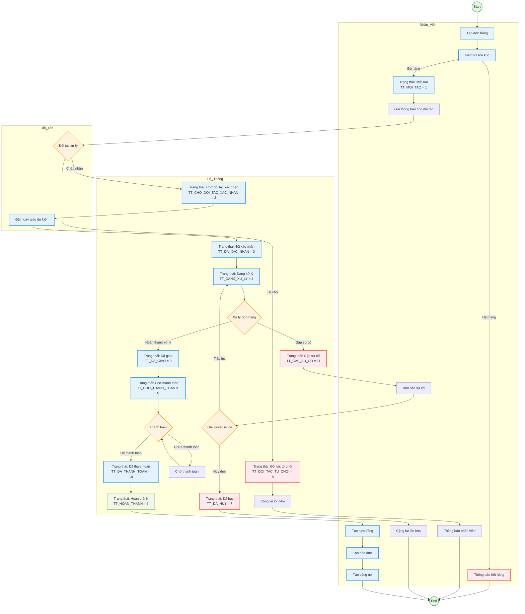
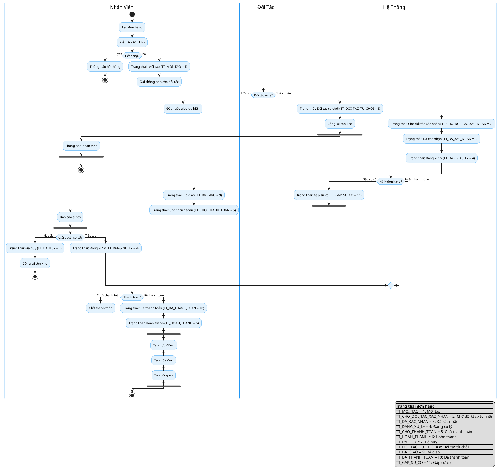

# Activity Diagram - Quy Trình Đơn Hàng

## Mermaid Activity Diagram

## PlantUML Activity Diagram

## Mô Tả Quy Trình

### **Các Trạng Thái Đơn Hàng**

| Trạng Thái | Mã | Mô Tả |
|-----------|----|-------|
| Mới tạo | 1 | Đơn hàng vừa được tạo bởi nhân viên |
| Chờ đối tác xác nhận | 2 | Đã gửi thông báo cho đối tác, chờ xử lý |
| Đã xác nhận | 3 | Đối tác đã chấp nhận và đặt ngày giao |
| Đang xử lý | 4 | Đang thực hiện đơn hàng |
| Chờ thanh toán | 5 | Đã giao hàng, chờ khách thanh toán |
| Hoàn thành | 6 | Đơn hàng hoàn thành 100% |
| Đã hủy | 7 | Đơn hàng bị hủy (do sự cố hoặc khách yêu cầu) |
| Đối tác từ chối | 8 | Đối tác từ chối đơn hàng |
| Đã giao | 9 | Đã giao hàng cho khách |
| Đã thanh toán | 10 | Khách đã thanh toán |
| Gặp sự cố | 11 | Có sự cố xảy ra trong quá trình xử lý |

### **Luồng Chính (Happy Path)**

1. **Nhân viên** tạo đơn hàng → Kiểm tra tồn kho
2. **Hệ thống** set trạng thái "Mới tạo" → Gửi thông báo đối tác
3. **Đối tác** chấp nhận → Đặt ngày giao dự kiến
4. **Hệ thống** cập nhật trạng thái: "Chờ xác nhận" → "Đã xác nhận" → "Đang xử lý"
5. **Hệ thống** hoàn thành xử lý → "Đã giao" → "Chờ thanh toán"
6. **Khách** thanh toán → "Đã thanh toán" → "Hoàn thành"
7. **Nhân viên** tạo: Hợp đồng → Hóa đơn → Công nợ

### **Luồng Exception**

**Đối tác từ chối:**
- Đối tác từ chối → "Đối tác từ chối" → Cộng lại tồn kho → Thông báo nhân viên → Kết thúc

**Gặp sự cố:**
- Gặp sự cố → "Gặp sự cố" → Báo cáo → Giải quyết
  - Nếu hủy: "Đã hủy" → Cộng lại tồn kho → Kết thúc
  - Nếu tiếp tục: Quay lại "Đang xử lý"

**Hết hàng:**
- Kiểm tra tồn kho → Hết hàng → Thông báo → Kết thúc

### **Các Actor Trong Quy Trình**

1. **Nhân viên:** Tạo đơn, xử lý sự cố, tạo hợp đồng/hóa đơn/công nợ
2. **Đối tác:** Xác nhận đơn hàng, đặt ngày giao
3. **Hệ thống:** Quản lý trạng thái, kiểm tra tồn kho, xử lý thanh toán
4. **Khách hàng:** Thanh toán (ngầm định)
