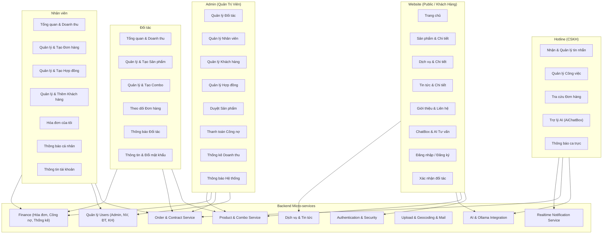
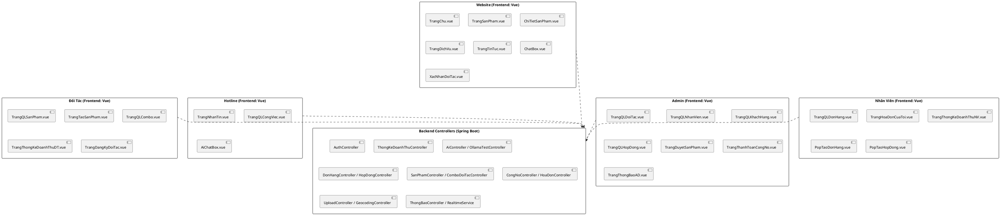

# Sơ Đồ Phân Rã Chức Năng Chi Tiết - Hệ Thống An Yên (Phiên bản Hoàn Chỉnh)

Tài liệu này mô tả chi tiết toàn bộ các phân hệ, chức năng và luồng dữ liệu của hệ thống **An Yên** dựa trên cấu trúc thực tế của mã nguồn Frontend và Backend.

## 1. Biểu Đồ Phân Rã Chức Năng Tổng Quan (Mermaid)

## 2. Biểu Đồ Cấu Trúc Thành Phần (PlantUML)

## 3. Chi Tiết Các Chức Năng Theo Phân Hệ (Role)

### 3.1. Website (Dành cho Khách Hàng / Public)
*Đây là bộ mặt của nền tảng, cho phép khách truy cập tham khảo, tương tác và mua sắm.*
- **Trang Chủ (`TrangChu.vue`):** Hiển thị banner, giới thiệu tổng quan, dịch vụ nổi bật, sản phẩm mới.
- **Sản Phẩm (`TrangSanPham.vue`, `ChiTietSanPham.vue`):** Danh mục sản phẩm tang lễ, bộ lọc, tìm kiếm, xem chi tiết, thông số, hình ảnh.
- **Dịch Vụ (`TrangDichVu.vue`, `TrangDichVuChiTiet.vue`):** Hiển thị các gói dịch vụ, thông tin các hạng mục đi kèm.
- **Tin Tức & Giới Thiệu (`TrangTinTuc.vue`, `ChiTietTinTuc.vue`, `TrangGioiThieu.vue`):** Blog kiến thức, cẩm nang, giới thiệu công ty An Yên.
- **Liên Hệ (`TrangLienHe.vue`, `PopLienHeHotline.vue`):** Form gửi yêu cầu, tích hợp bản đồ.
- **Tương Tác AI & Chat (`ChatBox.vue`):** Khách hàng chat với Hotline hoặc sử dụng trợ lý AI tư vấn tự động.
- **Xác Thực & Đăng Ký (`PopDangNhap.vue`, `XacNhanDoiTac.vue`):** Cho phép các bên đăng nhập, khách hàng xác nhận email lời mời.

### 3.2. Quản Trị Viên (Admin)
*Phân hệ có quyền lực cao nhất, vận hành và kiểm soát chất lượng toàn hệ thống.*
- **Quản lý Nhân Sự (`TrangQLNhanVien.vue`):** Cấp tài khoản, phân quyền, khóa tài khoản nhân viên.
- **Quản lý Đối Tác (`TrangQLDoiTac.vue`):** Duyệt hồ sơ đăng ký đối tác, quản lý thông tin, chấm dứt hợp tác.
- **Quản lý Khách Hàng (`TrangQLKhachHang.vue`):** Theo dõi toàn bộ dữ liệu người dùng, khách hàng của hệ thống.
- **Kiểm Duyệt Nội Dung (`TrangDuyetSanPham.vue`, `PopXemSanPham.vue`):** Xem xét, duyệt hoặc từ chối các sản phẩm/combo do đối tác tải lên trước khi xuất hiện trên Website.
- **Quản lý Giao Dịch (`TrangQLHopDong.vue`):** Theo dõi tiến độ hợp đồng, kiểm soát rủi ro pháp lý.
- **Tài Chính & Kế Toán (`TrangThanhToanCongNo.vue`, `ThongKeDoanhThuController`):** Theo dõi doanh thu tổng, thanh toán phần chia sẻ doanh thu cho đối tác, quản lý công nợ.
- **Hệ Thống Thông Báo (`TrangThongBaoAD.vue`):** Đẩy thông báo (Broadcast) đến các phân hệ khác.

### 3.3. Nhân Viên (NhanVien)
*Lực lượng nòng cốt xử lý nghiệp vụ bán hàng, hợp đồng và chăm sóc khách.*
- **Tổng Quan & Doanh Thu (`TrangTongQuan.vue`, `TrangThongKeDoanhThuNV.vue`):** Xem KPI cá nhân, số lượng đơn hàng/hợp đồng đã chốt.
- **Nghiệp Vụ Đơn Hàng (`TrangQLDonHang.vue`, `PopTaoDonHang.vue`, `PopChiTietDonHang.vue`):** Khởi tạo đơn mới cho khách, cập nhật trạng thái đơn (chờ xử lý -> đang giao -> hoàn thành).
- **Nghiệp Vụ Hợp Đồng (`TrangQLHopDong.vue`, `PopTaoHopDong.vue`, `PreviewHopDong.vue`):** Soạn thảo hợp đồng từ mẫu, xin duyệt, in PDF.
- **Chăm Sóc Khách Hàng (`TrangQLKhachHang.vue`, `PopThemKhachHang.vue`, `PopLichSuKhachHang.vue`):** Quản lý tệp khách hàng cá nhân, xem lịch sử mua hàng, nhu cầu.
- **Nghiệp Vụ Hóa Đơn (`TrangHoaDonCuaToi.vue`, `PopTaoHoaDon.vue`):** Xuất hóa đơn cho đơn hàng/hợp đồng đã hoàn thành.
- **Thông Báo (`TrangThongBaoNV.vue`):** Nhận thông báo công việc, đơn hàng mới.

### 3.4. Đối Tác (DoiTac)
*Nhà cung cấp sản phẩm (vật phẩm tang lễ) tham gia vào hệ sinh thái An Yên.*
- **Đăng Ký Tài Khoản (`TrangDangKyDoiTac.vue`):** Quy trình onboarding cung cấp thông tin doanh nghiệp, chờ Admin duyệt.
- **Dashboard Doanh Số (`TrangTongQuan.vue`, `TrangThongKeDoanhThuDT.vue`):** Thống kê sản phẩm bán chạy, doanh thu thực tế nhận được.
- **Quản Lý Sản Phẩm (`TrangQLSanPham.vue`, `TrangTaoSanPham.vue`):** Đăng tải sản phẩm mới (tên, giá, hình ảnh, mô tả), quản lý tồn kho, ẩn/hiện sản phẩm.
- **Quản Lý Combo (`TrangQLCombo.vue`, `TaoCombo.vue`):** Đóng gói nhiều sản phẩm thành 1 gói combo để tăng doanh số.
- **Quản Lý Đơn Hàng (`TrangQLDonHang.vue`):** Xem các đơn hàng phát sinh chứa sản phẩm của mình, phối hợp giao hàng.
- **Thông Báo & Tài Khoản (`TrangThongBaoDT.vue`, `TrangThongTinTK.vue`):** Nhận thông báo khi sản phẩm được duyệt, đổi mật khẩu.

### 3.5. Hotline (CSKH)
*Đội ngũ trực tổng đài, hỗ trợ giải đáp nhanh cho khách hàng.*
- **Tương Tác Khách Hàng (`TrangNhanTin.vue`, `TrangQuanLyTinNhan.vue`):** Tiếp nhận chat từ Website, trả lời thắc mắc, phân loại yêu cầu.
- **Quản Lý Công Việc (`TrangQLCongViec.vue`):** Theo dõi các ticket, yêu cầu hỗ trợ chưa giải quyết.
- **Tra Cứu Nhanh (`TrangQLDonHang.vue`):** Xem thông tin đơn hàng để báo cáo tình trạng cho khách.
- **Trợ Lý AI (`AiChatBox.vue`):** Sử dụng AI RAG để tra cứu nhanh các chính sách, quy định của công ty hỗ trợ công việc.

## 4. Chi Tiết Backend (API Services - Cốt Lõi Hệ Thống)

Dựa trên cấu trúc Controller thực tế:

| Khối Chức Năng | Thành Phần Controller | Trách Nhiệm Chi Tiết |
|----------------|-----------------------|----------------------|
| **Authentication & Users** | `AuthController`, `TaiKhoanController`, `DoiTacTaiKhoanController`, `NhanVienTaiKhoanController` | Xử lý Login, JWT Token, đổi mật khẩu, phân quyền role, quản lý profile. |
| **Quản Lý Cốt Lõi** | `QuanLyNhanVienController`, `QuanLyKhachHang`, `QuanLyDoiTacController`, `DoiTacXacNhanController` | Các API CRUD dành cho Admin để vận hành hệ thống tài khoản. Xử lý email xác nhận. |
| **Sản Phẩm & Dịch Vụ** | `SanPhamController`, `SanPhamDoiTacController`, `ComboDoiTacController`, `DichVuController` | Xử lý logic đăng sản phẩm, duyệt sản phẩm, tính toán giá trị combo, danh mục dịch vụ. |
| **Giao Dịch (Core)** | `DonHangController`, `NhanVienDonHangController`, `DoiTacDonHangController`, `HopDongController`, `QuanLyHopDongController` | State machine cho Đơn hàng/Hợp đồng. Ràng buộc quyền: NV tạo, ĐT xem, Admin duyệt. |
| **Tài Chính** | `HoaDonController`, `HoaDonCuaToiController`, `CongNoController`, `ThongKeDoanhThuController` | Kết xuất hóa đơn, tính toán doanh thu theo thời gian, tính số tiền An Yên phải trả cho Đối tác (Công nợ). |
| **Tương Tác Khách** | `KhachHangController`, `TuVanKhachController`, `TuVanNhanVienController`, `HotlineCongViecController` | Quản lý logic chat, giao việc cho Hotline, lưu vết lịch sử tư vấn. |
| **Hệ Thống Trợ Lý AI** | `AiController`, `OllamaTestController`, `YeuCauTuVanAiController` | Giao tiếp với model Ollama cục bộ hoặc server AI. Xử lý logic NLP, trả lời tự động cho khách hoặc trợ lý tư vấn cho nhân viên. |
| **Utility & Integration**| `UploadController`, `GeocodingController`, `ThongBaoController`, `DoiTacThongBaoController`, `TinTucController`, `LienHeController` | Upload ảnh lên Cloudinary, tính toán vị trí Google Maps/OSM, gửi thông báo Realtime, quản lý bài viết blog. |

## 5. Ma Trận Quyền Hạn (Role - Access Matrix)

| Chức Năng Cốt Lõi | Website (Khách) | Admin | Nhân Viên | Đối Tác | Hotline |
|-------------------|-----------------|-------|-----------|---------|---------|
| Đăng nhập / Đổi Pass | ❌ (Chỉ xem) | ✅ | ✅ | ✅ | ✅ |
| Xem Sản Phẩm / Dịch Vụ| ✅ | ✅ | ✅ | ✅ | ✅ |
| Đăng Sản Phẩm / Combo | ❌ | ❌ | ❌ | ✅ | ❌ |
| Duyệt Sản Phẩm | ❌ | ✅ | ❌ | ❌ | ❌ |
| Tạo Đơn Hàng / Hợp Đồng| ❌ | ❌ | ✅ | ❌ | ❌ |
| Theo Dõi Đơn Hàng | ❌ | ❌ | ✅ | ✅ | ✅ |
| Hỗ Trợ Trực Tuyến | ✅ (Người hỏi) | ❌ | ❌ | ❌ | ✅ (Người trả lời)|
| Sử Dụng AI Assistant | ✅ (Chatbot) | ❌ | ❌ | ❌ | ✅ (Trợ lý nghiệp vụ)|
| Xem Báo Cáo Doanh Thu | ❌ | ✅ (Tổng) | ✅ (Cá nhân) | ✅ (Sản phẩm ĐT) | ❌ |
| Thanh Toán / Công Nợ | ❌ | ✅ | ❌ | ✅ (Xem) | ❌ |
