# Sơ Đồ Phân Rã Chức Năng - Hệ Thống An Yên

## Mermaid Diagram - Phân Rã Chức Năng Theo Role

```mermaid
graph TB
    subgraph Website["Website (Public)"]
        WC["Trang chủ"]
        WSP["Sản phẩm"]
        WSPD["Chi tiết sản phẩm"]
        WSV["Dịch vụ"]
        WSVD["Chi tiết dịch vụ"]
        WGI["Giới thiệu"]
        WLI["Liên hệ"]
        WTT["Tin tức"]
        WTTD["Chi tiết tin tức"]
        WCB["ChatBox AI"]
        WDL["Đăng nhập"]
        WXN["Xác nhận đối tác"]
    end
    
    subgraph Admin["Admin"]
        ADT["Quản lý đối tác"]
        ANV["Quản lý nhân viên"]
        AKH["Quản lý khách hàng"]
        AHĐ["Quản lý hợp đồng"]
        ASP["Duyệt sản phẩm"]
        ACN["Thanh toán công nợ"]
        ATB["Thông báo"]
    end
    
    subgraph NhanVien["Nhân viên"]
        NVDH["Quản lý đơn hàng"]
        NVTĐH["Tạo đơn hàng"]
        NVHĐ["Quản lý hợp đồng"]
        NVTHĐ["Tạo hợp đồng"]
        NVKH["Quản lý khách hàng"]
        NVTKH["Thêm khách hàng"]
        NVHD["Hóa đơn của tôi"]
        NVTB["Thông báo"]
        NVTB["Thông tin tài khoản"]
    end
    
    subgraph DoiTac["Đối tác"]
        DTSP["Quản lý sản phẩm"]
        DTTS["Tạo sản phẩm"]
        DTDH["Quản lý đơn hàng"]
        DTCB["Quản lý combo"]
        DTTB["Combo"]
        DTTB2["Thông báo"]
        DTTK["Thông tin tài khoản"]
        DTDK["Đăng ký đối tác"]
    end
    
    subgraph Hotline["Hotline"]
        HLNT["Nhận tin nhắn"]
        HLCV["Quản lý công việc"]
        HLDH["Quản lý đơn hàng"]
        HLAI["Chat AI"]
        HLTB["Thông báo"]
    end
    
    subgraph Backend["Backend Services"]
        AUTH["Authentication"]
        QLDT["Quản lý đối tác"]
        QLNV["Quản lý nhân viên"]
        QLKH["Quản lý khách hàng"]
        SP["Sản phẩm"]
        DH["Đơn hàng"]
        HD["Hợp đồng"]
        HĐON["Hóa đơn"]
        CN["Công nợ"]
        TB["Thông báo"]
        DV["Dịch vụ"]
        TT["Tin tức"]
        AI["AI Services"]
        UP["Upload"]
        GEO["Geocoding"]
    end
    
    %% Website connections
    WC --> SP
    WSP --> WSPD
    WSP --> AUTH
    WSV --> WSVD
    WTT --> WTTD
    WCB --> AI
    WDL --> AUTH
    WXN --> AUTH
    
    %% Admin connections
    ADT --> QLDT
    ANV --> QLNV
    AKH --> QLKH
    AHĐ --> HD
    ASP --> SP
    ACN --> CN
    ATB --> TB
    
    %% NhanVien connections
    NVDH --> DH
    NVTĐH --> DH
    NVHĐ --> HD
    NVTHĐ --> HD
    NVKH --> QLKH
    NVTKH --> QLKH
    NVHD --> HĐON
    NVTB --> TB
    NVTB --> AUTH
    
    %% DoiTac connections
    DTSP --> SP
    DTTS --> SP
    DTDH --> DH
    DTCB --> SP
    DTTB --> SP
    DTTB2 --> TB
    DTTK --> AUTH
    DTDK --> AUTH
    
    %% Hotline connections
    HLNT --> AI
    HLCV --> DH
    HLDH --> DH
    HLAI --> AI
    HLTB --> TB
    
    %% Backend connections
    AUTH --> QLDT
    AUTH --> QLNV
    AUTH --> QLKH
    
    style Website fill:#e3f2fd,stroke:#2196f3
    style Admin fill:#fff3e0,stroke:#ff9800
    style NhanVien fill:#f3e5f5,stroke:#9c27b0
    style DoiTac fill:#e8f5e9,stroke:#4caf50
    style Hotline fill:#fce4ec,stroke:#e91e63
    style Backend fill:#f5f5f5,stroke:#616161
```

## PlantUML Diagram - Phân Rã Chức Năng Chi Tiết

```plantuml
@startuml PhanRangChucNang

skinparam rectangle {
    BackgroundColor #f8f9fa
    BorderColor #6c757d
}

skinparam packageStyle rectangle

package "Website (Public)" as Website {
    [Trang chủ] as WC
    [Sản phẩm] as WSP
    [Chi tiết sản phẩm] as WSPD
    [Dịch vụ] as WSV
    [Chi tiết dịch vụ] as WSVD
    [Giới thiệu] as WGI
    [Liên hệ] as WLI
    [Tin tức] as WTT
    [Chi tiết tin tức] as WTTD
    [ChatBox AI] as WCB
    [Đăng nhập] as WDL
    [Xác nhận đối tác] as WXN
}

package "Admin" as Admin {
    [Quản lý đối tác] as ADT
    [Quản lý nhân viên] as ANV
    [Quản lý khách hàng] as AKH
    [Quản lý hợp đồng] as AHĐ
    [Duyệt sản phẩm] as ASP
    [Thanh toán công nợ] as ACN
    [Thông báo] as ATB
}

package "Nhân viên" as NhanVien {
    [Quản lý đơn hàng] as NVDH
    [Tạo đơn hàng] as NVTĐH
    [Quản lý hợp đồng] as NVHĐ
    [Tạo hợp đồng] as NVTHĐ
    [Quản lý khách hàng] as NVKH
    [Thêm khách hàng] as NVTKH
    [Hóa đơn của tôi] as NVHD
    [Thông báo] as NVTB
    [Thông tin tài khoản] as NVTB
}

package "Đối tác" as DoiTac {
    [Quản lý sản phẩm] as DTSP
    [Tạo sản phẩm] as DTTS
    [Quản lý đơn hàng] as DTDH
    [Quản lý combo] as DTCB
    [Tạo combo] as DTTB
    [Thông báo] as DTTB2
    [Thông tin tài khoản] as DTTK
    [Đăng ký đối tác] as DTDK
}

package "Hotline" as Hotline {
    [Nhận tin nhắn] as HLNT
    [Quản lý công việc] as HLCV
    [Quản lý đơn hàng] as HLDH
    [Chat AI] as HLAI
    [Thông báo] as HLTB
}

package "Backend Services" as Backend {
    [Authentication] as AUTH
    [Quản lý đối tác] as QLDT
    [Quản lý nhân viên] as QLNV
    [Quản lý khách hàng] as QLKH
    [Sản phẩm] as SP
    [Đơn hàng] as DH
    [Hợp đồng] as HD
    [Hóa đơn] as HĐON
    [Công nợ] as CN
    [Thông báo] as TB
    [Dịch vụ] as DV
    [Tin tức] as TT
    [AI Services] as AI
    [Upload] as UP
    [Geocoding] as GEO
}

' Website connections
WC -down-> WSP
WSP -down-> WSPD
WSP -right-> AUTH
WSV -down-> WSVD
WTT -down-> WTTD
WCB -right-> AI
WDL -right-> AUTH
WXN -right-> AUTH

' Admin connections
ADT -down-> QLDT
ANV -down-> QLNV
AKH -down-> QLKH
AHĐ -down-> HD
ASP -down-> SP
ACN -down-> CN
ATB -down-> TB

' NhanVien connections
NVDH -down-> DH
NVTĐH -down-> DH
NVHĐ -down-> HD
NVTHĐ -down-> HD
NVKH -down-> QLKH
NVTKH -down-> QLKH
NVHD -down-> HĐON
NVTB -down-> TB
NVTB -right-> AUTH

' DoiTac connections
DTSP -down-> SP
DTTS -down-> SP
DTDH -down-> DH
DTCB -down-> SP
DTTB -down-> SP
DTTB2 -down-> TB
DTTK -right-> AUTH
DTDK -right-> AUTH

' Hotline connections
HLNT -right-> AI
HLCV -down-> DH
HLDH -down-> DH
HLAI -right-> AI
HLTB -down-> TB

' Backend connections
AUTH -down-> QLDT
AUTH -down-> QLNV
AUTH -down-> QLKH

@enduml
```

## Chi Tiết Phân Rã Chức Năng Theo Role

### **1. Website (Public)**
- **Trang chủ:** Hiển thị overview hệ thống
- **Sản phẩm:** Danh sách sản phẩm tang lễ
- **Chi tiết sản phẩm:** Xem chi tiết, thông số, hình ảnh
- **Dịch vụ:** Danh sách dịch vụ tang lễ
- **Chi tiết dịch vụ:** Chi tiết gói dịch vụ
- **Giới thiệu:** Giới thiệu về An Yên
- **Liên hệ:** Form liên hệ, thông tin contact
- **Tin tức:** Blog tin tức, sự kiện
- **Chi tiết tin tức:** Chi tiết bài viết
- **ChatBox AI:** Chatbot AI hỗ trợ khách hàng
- **Đăng nhập:** Login popup (khách hàng, nhân viên, đối tác, hotline)
- **Xác nhận đối tác:** Xác nhận lời mời hợp tác qua email

### **2. Admin**
- **Quản lý đối tác:** Thêm, sửa, xóa, thay đổi trạng thái đối tác
- **Quản lý nhân viên:** Thêm, sửa, xóa nhân viên
- **Quản lý khách hàng:** Xem, quản lý thông tin khách hàng
- **Quản lý hợp đồng:** Xem, duyệt hợp đồng
- **Duyệt sản phẩm:** Duyệt/từ chối sản phẩm của đối tác
- **Thanh toán công nợ:** Quản lý công nợ đối tác
- **Thông báo:** Gửi thông báo hệ thống

### **3. Nhân viên**
- **Quản lý đơn hàng:** Xem, xử lý đơn hàng
- **Tạo đơn hàng:** Tạo đơn hàng mới cho khách hàng
- **Quản lý hợp đồng:** Xem danh sách hợp đồng
- **Tạo hợp đồng:** Tạo hợp đồng mới
- **Quản lý khách hàng:** Xem thông tin khách hàng
- **Thêm khách hàng:** Thêm khách hàng mới
- **Hóa đơn của tôi:** Xem hóa đơn đã tạo
- **Thông báo:** Xem thông báo cá nhân
- **Thông tin tài khoản:** Xem/cập nhật thông tin cá nhân

### **4. Đối tác**
- **Quản lý sản phẩm:** Xem, sửa, ẩn/hiện sản phẩm
- **Tạo sản phẩm:** Tạo sản phẩm mới (chờ duyệt)
- **Quản lý đơn hàng:** Xem đơn hàng của sản phẩm
- **Quản lý combo:** Xem, quản lý combo sản phẩm
- **Tạo combo:** Tạo combo mới
- **Thông báo:** Xem thông báo (duyệt sản phẩm, đơn hàng)
- **Thông tin tài khoản:** Xem/cập nhật thông tin
- **Đăng ký đối tác:** Đăng ký trở thành đối tác (4 bước)

### **5. Hotline**
- **Nhận tin nhắn:** Nhận tin nhắn từ khách hàng
- **Quản lý công việc:** Quản lý công việc hotline
- **Quản lý đơn hàng:** Xem đơn hàng liên quan
- **Chat AI:** Chat AI hỗ trợ tư vấn
- **Thông báo:** Xem thông báo công việc

### **6. Backend Services**

#### **Authentication**
- Đăng nhập (khách hàng, nhân viên, đối tác, hotline)
- Đăng ký đối tác
- Xác thực token
- Quên mật khẩu
- Đổi mật khẩu

#### **Quản lý đối tác**
- CRUD đối tác
- Gửi lời mời hợp tác qua email
- Xác nhận token email
- Ký hợp đồng
- Thay đổi trạng thái (đang hợp tác, ngưng hợp tác)
- Xóa mềm đối tác

#### **Quản lý nhân viên**
- CRUD nhân viên
- Phân quyền
- Thay đổi trạng thái

#### **Quản lý khách hàng**
- CRUD khách hàng
- Lịch sử khách hàng
- Thông tin liên hệ

#### **Sản phẩm**
- CRUD sản phẩm (admin, đối tác)
- Duyệt sản phẩm (admin)
- Ẩn/hiện sản phẩm
- Tìm kiếm, lọc sản phẩm
- Upload hình ảnh
- Chi tiết sản phẩm
- Combo sản phẩm

#### **Đơn hàng**
- Tạo đơn hàng (nhân viên)
- Xem đơn hàng (nhân viên, đối tác, hotline)
- Cập nhật trạng thái đơn hàng
- Chi tiết đơn hàng
- Lịch sử đơn hàng

#### **Hợp đồng**
- Tạo hợp đồng (nhân viên)
- Xem hợp đồng (admin, nhân viên)
- Duyệt hợp đồng (admin)
- Preview hợp đồng
- Lịch sử hợp đồng

#### **Hóa đơn**
- Tạo hóa đơn (nhân viên)
- Xem hóa đơn (nhân viên)
- In hóa đơn
- Lịch sử hóa đơn

#### **Công nợ**
- Quản lý công nợ đối tác
- Thanh toán công nợ
- Lịch sử công nợ

#### **Thông báo**
- Gửi thông báo (admin)
- Xem thông báo (nhân viên, đối tác, hotline)
- Đánh dấu đã đọc
- Loại thông báo (duyệt sản phẩm, đơn hàng, công việc)

#### **Dịch vụ**
- CRUD dịch vụ
- Chi tiết dịch vụ

#### **Tin tức**
- CRUD tin tức
- Chi tiết tin tức

#### **AI Services**
- Chatbot AI
- Tư vấn khách hàng AI
- Ollama integration

#### **Upload**
- Upload hình ảnh lên Cloudinary
- Validate file (type, size)

#### **Geocoding**
- Geocoding địa chỉ
- Tọa độ địa lý

## Ma Trận Chức Năng

| Chức năng | Website | Admin | Nhân viên | Đối tác | Hotline |
|-----------|---------|-------|-----------|---------|---------|
| Xem sản phẩm | ✅ | ✅ | ✅ | ✅ | ✅ |
| Tạo sản phẩm | ❌ | ❌ | ❌ | ✅ | ❌ |
| Duyệt sản phẩm | ❌ | ✅ | ❌ | ❌ | ❌ |
| Tạo đơn hàng | ❌ | ❌ | ✅ | ❌ | ❌ |
| Xem đơn hàng | ❌ | ❌ | ✅ | ✅ | ✅ |
| Tạo hợp đồng | ❌ | ❌ | ✅ | ❌ | ❌ |
| Duyệt hợp đồng | ❌ | ✅ | ❌ | ❌ | ❌ |
| Quản lý khách hàng | ❌ | ✅ | ✅ | ❌ | ❌ |
| Quản lý đối tác | ❌ | ✅ | ❌ | ❌ | ❌ |
| Quản lý nhân viên | ❌ | ✅ | ❌ | ❌ | ❌ |
| Thanh toán công nợ | ❌ | ✅ | ❌ | ❌ | ❌ |
| Chat AI | ✅ | ❌ | ❌ | ❌ | ✅ |
| Thông báo | ❌ | ✅ | ✅ | ✅ | ✅ |
| Đăng ký đối tác | ✅ | ❌ | ❌ | ❌ | ❌ |

## Kiến Trúc Hệ Thống

### **Frontend (Vue 3)**
- **Router:** Vue Router với role-based guards
- **State Management:** Reactive refs, props
- **API:** Axios với interceptors
- **Components:** Reusable components
- **Layouts:** Layout theo role (AdminLayout, NhanVienLayout, DoiTacLayout, HotlineLayout, WebsiteLayout)

### **Backend (Spring Boot)**
- **Controller:** REST API endpoints
- **Service:** Business logic
- **Repository:** JPA repositories
- **Entity:** Database entities
- **Security:** Spring Security, JWT
- **Email:** JavaMailSender, Thymeleaf
- **AI:** Ollama integration

### **Database**
- **doitac:** Thông tin đối tác
- **nhanvien:** Thông tin nhân viên
- **khachhang:** Thông tin khách hàng
- **sanpham:** Sản phẩm
- **donhang:** Đơn hàng
- **chitietdonhang:** Chi tiết đơn hàng
- **hopdong:** Hợp đồng
- **hoadon:** Hóa đơn
- **congno:** Công nợ
- **thongbao:** Thông báo
- **dichvu:** Dịch vụ
- **tintuc:** Tin tức
- **sanphamchitiet:** Chi tiết sản phẩm
- **sanphamhinhanh:** Hình ảnh sản phẩm

## Quyền Hạn Theo Role

### **Admin**
- Full quyền trên tất cả module
- Quản lý user (nhân viên, đối tác, khách hàng)
- Duyệt sản phẩm, hợp đồng
- Quản lý công nợ
- Gửi thông báo hệ thống

### **Nhân viên**
- Tạo đơn hàng, hợp đồng, hóa đơn
- Quản lý khách hàng
- Xem thông báo
- Cập nhật thông tin cá nhân

### **Đối tác**
- Tạo/sửa/xóa sản phẩm (chờ duyệt)
- Tạo combo sản phẩm
- Xem đơn hàng
- Xem thông báo
- Cập nhật thông tin cá nhân

### **Hotline**
- Nhận tin nhắn khách hàng
- Chat AI
- Quản lý công việc
- Xem đơn hàng
- Xem thông báo

### **Khách hàng (Website)**
- Xem sản phẩm, dịch vụ
- Chat AI
- Liên hệ
- Đăng nhập
