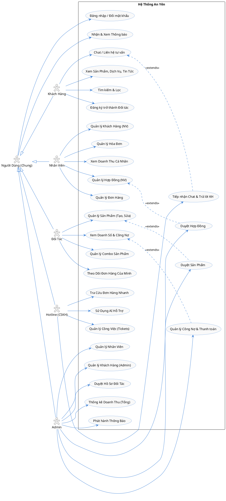

# Sơ Đồ Use Case Tổng Quát - Hệ Thống An Yên

Tài liệu này cung cấp **Sơ đồ Use Case (Biểu đồ ca sử dụng)** thể hiện tổng quát mọi chức năng, hành vi của các tác nhân (Actor) khi tương tác với hệ thống An Yên.

## 1. Sơ Đồ Use Case (PlantUML)

Bạn có thể render đoạn code PlantUML dưới đây trong các công cụ hỗ trợ (như PlantUML plugin, planttext.com) để xem dưới dạng hình ảnh.

## 2. Giải Thích Các Actor (Tác nhân)

| Actor | Mô tả |
|-------|-------|
| **Khách Hàng** | Người dùng phổ thông truy cập Website (có thể chưa đăng nhập hoặc đã đăng nhập). Nhu cầu chính là tham khảo vật phẩm, dịch vụ tang lễ, cập nhật kiến thức và liên hệ tư vấn. |
| **Nhân Viên** | Người xử lý nghiệp vụ bán hàng. Có nhiệm vụ lập hợp đồng, tạo đơn hàng cho khách hàng, xuất hóa đơn và theo dõi tiến độ dịch vụ. |
| **Đối Tác** | Các nhà cung cấp, xưởng sản xuất vật phẩm tang lễ. Cung cấp sản phẩm lên hệ thống để hưởng phần trăm/giá trị đơn hàng. |
| **Hotline (CSKH)** | Bộ phận trực tổng đài và chat trực tuyến, giúp giải đáp thắc mắc, điều phối yêu cầu cho khách hàng với sự hỗ trợ của Trợ lý AI. |
| **Admin** | Quản trị viên cấp cao nhất. Có quyền quyết định duyệt đối tác, duyệt các sản phẩm mới, kiểm soát hợp đồng, theo dõi báo cáo doanh thu và thanh toán công nợ. |

## 3. Danh Sách Use Case Quan Trọng

### 3.1. Nhóm Dùng Chung
* **Đăng nhập / Đổi mật khẩu:** Dành cho tất cả các tài khoản nội bộ (Admin, NV, ĐT, Hotline) và khách hàng.
* **Nhận & Xem Thông báo:** Quản lý thông báo công việc, trạng thái đơn hàng (sử dụng Realtime).

### 3.2. Nhóm Khách Hàng
* **Xem Sản Phẩm, Dịch Vụ, Tin Tức:** Tìm hiểu các thông tin công khai về dịch vụ mai táng, vật phẩm, cẩm nang.
* **Chat / Liên hệ tư vấn:** Tương tác với Hotline hoặc Chatbot AI để hỏi đáp, yêu cầu dịch vụ.
* **Đăng ký trở thành Đối tác:** Gửi hồ sơ công ty và chờ hệ thống (Admin) duyệt.

### 3.3. Nhóm Quản Trị Viên (Admin)
* **Quản lý Nhân Viên:** Khởi tạo, cấp tài khoản và phân quyền cho nhân sự.
* **Duyệt Hồ Sơ Đối Tác:** Xác nhận tư cách Đối tác (được bán hàng trên nền tảng) qua Email và Hợp đồng hợp tác.
* **Duyệt Sản Phẩm / Hợp Đồng:** Kiểm duyệt các sản phẩm mới do Đối tác tải lên. Duyệt tính hợp lệ của Hợp đồng do Nhân viên lập.
* **Quản lý Công Nợ:** Xem đối soát số tiền cần trả cho từng Đối tác tương ứng với số lượng hàng họ đã bán được trên hệ thống.

### 3.4. Nhóm Nhân Viên
* **Quản lý Đơn Hàng:** Lên đơn vật phẩm, cập nhật trạng thái giao hàng, liên hệ khách.
* **Quản lý Hợp Đồng:** Khởi tạo hợp đồng mẫu cho khách, nạp thông tin để chuyển trạng thái chờ Duyệt.
* **Quản lý Hóa Đơn:** Lập hóa đơn khi chốt xong đơn hàng/hợp đồng.

### 3.5. Nhóm Đối Tác
* **Quản lý Sản Phẩm / Combo:** Nhập thông tin (tên, giá, ảnh...) lên hệ thống chờ Admin duyệt. Tạo các gói Combo để tối ưu doanh thu.
* **Theo Dõi Đơn Hàng Của Mình:** Xem đơn hàng có liên quan tới sản phẩm của mình, biết được có bao nhiêu hàng đã bán.

### 3.6. Nhóm Hotline
* **Tiếp nhận Chat & Trả lời KH:** Giao tiếp trực tiếp với khách từ Website.
* **Sử Dụng AI Hỗ Trợ:** Dùng RAG/Ollama để tra cứu nhanh cẩm nang, quy trình tang lễ giúp phản hồi khách 1 cách chính xác.
* **Quản lý Công Việc (Tickets):** Theo dõi các task cần xử lý trong ca trực.
