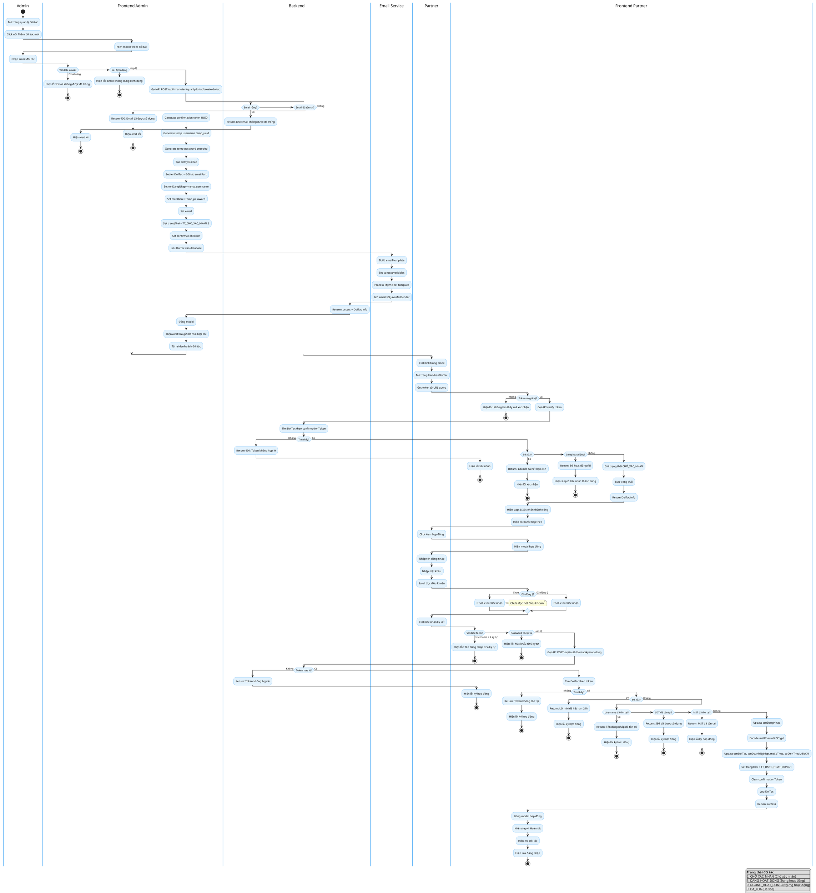

# Activity Diagram - Quy Trình Tạo Đối Tác

## Mermaid Activity Diagram

```mermaid
flowchart TD
    Start((Start)) --> AdminOpen[Admin mở trang quản lý đối tác]
    AdminOpen --> ClickAdd[Click nút Thêm đối tác mới]
    ClickAdd --> ShowModal[Hiện modal thêm đối tác]
    
    ShowModal --> InputEmail[Admin nhập email đối tác]
    InputEmail --> ValidateEmail{Validate email}
    ValidateEmail -->|Email rỗng| ShowErrorEmpty[Hiện lỗi: Email không được để trống]
    ShowErrorEmpty --> InputEmail
    ValidateEmail -->|Sai định dạng| ShowErrorFormat[Hiện lỗi: Email không đúng định dạng]
    ShowErrorFormat --> InputEmail
    ValidateEmail -->|Hợp lệ| CallAPI[Gọi API POST /api/nhan-vien/quanlydoitac/create-doitac]
    
    CallAPI --> Backend{Backend xử lý}
    Backend --> CheckEmailEmpty{Email rỗng?}
    CheckEmailEmpty -->|Có| Return400Empty[Return 400: Email không được để trống]
    Return400Empty --> FrontendError
    
    CheckEmailEmpty -->|Không| CheckEmailExists{Email đã tồn tại?}
    CheckEmailExists -->|Có| Return400Exists[Return 400: Email đã được sử dụng]
    Return400Exists --> FrontendError
    
    CheckEmailExists -->|Không| GenerateToken[Generate confirmation token UUID]
    GenerateToken --> GenerateTempUser[Generate temp username temp_uuid]
    GenerateTempUser --> GenerateTempPass[Generate temp password encoded]
    GenerateTempPass --> CreateEntity[Tạo entity DoiTac]
    
    CreateEntity --> SetTempInfo[Set tenDoiTac = Đối tác emailPart]
    SetTempInfo --> SetTempUsername[Set tenDangNhap = temp_username]
    SetTempUsername --> SetTempPassword[Set matKhau = temp_password]
    SetTempPassword --> SetEmail[Set email]
    SetEmail --> SetStatusPending[Set trangThai = TT_CHO_XAC_NHAN 2]
    SetStatusPending --> SetToken[Set confirmationToken]
    SetToken --> SaveDoiTac[Lưu DoiTac vào database]
    
    SaveDoiTac --> BuildEmail[Build email template]
    BuildEmail --> SetEmailContext[Set context variables: tenDoiTac, confirmUrl, etc]
    SetEmailContext --> ProcessTemplate[Process Thymeleaf template]
    ProcessTemplate --> SendEmail[Gửi email với JavaMailSender]
    SendEmail --> ReturnSuccess[Return success + DoiTac info]
    
    ReturnSuccess --> FrontendSuccess{Frontend xử lý}
    FrontendSuccess --> CloseModal[Đóng modal]
    CloseModal --> ShowSuccessMsg[Hiện alert: Đã gửi lời mời hợp tác]
    ShowSuccessMsg --> RefreshList[Tải lại danh sách đối tác]
    RefreshList --> WaitPartner[Chờ đối tác click link]
    
    WaitPartner --> PartnerClick[Đối tác click link trong email]
    PartnerClick --> OpenVerifyPage[Mở trang XacNhanDoiTac]
    OpenVerifyPage --> GetToken[Get token từ URL query]
    GetToken --> CheckToken{Token có giá trị?}
    CheckToken -->|Không| ShowErrorToken[Hiện lỗi: Không tìm thấy mã xác nhận]
    ShowErrorToken --> End((End))
    
    CheckToken -->|Có| CallVerifyAPI[Gọi API verify token]
    CallVerifyAPI --> BackendVerify{Backend verify token}
    BackendVerify --> FindByToken[Tìm DoiTac theo confirmationToken]
    FindByToken --> TokenExists{Tìm thấy?}
    TokenExists -->|Không| Return404Token[Return 404: Token không hợp lệ]
    Return404Token --> VerifyError
    
    TokenExists -->|Có| CheckDeleted{Đã xóa?}
    CheckDeleted -->|Có| ReturnExpired[Return: Lời mời đã hết hạn 24h]
    ReturnExpired --> VerifyError
    
    CheckDeleted -->|Không| CheckActive{Đang hoạt động?}
    CheckActive -->|Có| ReturnAlready[Return: Đã hoạt động rồi]
    ReturnAlready --> VerifySuccess
    
    CheckActive -->|Không| KeepPending[Giữ trạng thái CHỞ_XÁC_NHAN]
    KeepPending --> SaveVerify[Lưu trạng thái]
    SaveVerify --> ReturnVerifySuccess[Return DoiTac info]
    
    ReturnVerifySuccess --> VerifySuccess{Frontend verify success}
    VerifySuccess --> ShowStep2[Hiện step 2: Xác nhận thành công]
    ShowStep2 --> ShowNextSteps[Hiện các bước tiếp theo]
    ShowNextSteps --> ClickViewContract[Đối tác click Xem hợp đồng]
    ClickViewContract --> ShowModalContract[Hiện modal hợp đồng]
    
    ShowModalContract --> InputUsername[Đối tác nhập tên đăng nhập]
    InputUsername --> InputPassword[Đối tác nhập mật khẩu]
    InputPassword --> ScrollTerms[Đối tác scroll đọc điều khoản]
    ScrollTerms --> CheckAgree{Đã đồng ý?}
    CheckAgree -->|Chưa| DisableSubmit[Disable nút Xác nhận]
    DisableSubmit --> ScrollTerms
    CheckAgree -->|Đã đồng ý| EnableSubmit[Enable nút Xác nhận]
    EnableSubmit --> ClickSubmit[Click Xác nhận ký kết]
    
    ClickSubmit --> ValidateForm{Validate form}
    ValidateForm -->|Username < 4 ký tự| ShowErrorUser[Hiện lỗi: Tên đăng nhập từ 4 ký tự]
    ShowErrorUser --> InputUsername
    ValidateForm -->|Password < 6 ký tự| ShowErrorPass[Hiện lỗi: Mật khẩu từ 6 ký tự]
    ShowErrorPass --> InputPassword
    
    ValidateForm -->|Hợp lệ| CallContractAPI[Gọi API POST /api/auth/doi-tac/ky-hop-dong]
    CallContractAPI --> BackendContract{Backend ký hợp đồng}
    BackendContract --> ValidateTokenContract{Token hợp lệ?}
    ValidateTokenContract -->|Không| ReturnInvalidToken[Return: Token không hợp lệ]
    ReturnInvalidToken --> ContractError
    
    ValidateTokenContract -->|Có| FindByTokenContract[Tìm DoiTac theo token]
    FindByTokenContract --> TokenContractExists{Tìm thấy?}
    TokenContractExists -->|Không| ReturnNotFound[Return: Token không tồn tại]
    ReturnNotFound --> ContractError
    
    TokenContractExists -->|Có| CheckDeletedContract{Đã xóa?}
    CheckDeletedContract -->|Có| ReturnExpiredContract[Return: Lời mời đã hết hạn 24h]
    ReturnExpiredContract --> ContractError
    
    CheckDeletedContract -->|Không| CheckUsernameExists{Username đã tồn tại?}
    CheckUsernameExists -->|Có| ReturnUsernameTaken[Return: Tên đăng nhập đã tồn tại]
    ReturnUsernameTaken --> ContractError
    
    CheckUsernameExists -->|Không| CheckPhoneExists{SĐT đã tồn tại?}
    CheckPhoneExists -->|Có| ReturnPhoneTaken[Return: SĐT đã được sử dụng]
    ReturnPhoneTaken --> ContractError
    
    CheckUsernameExists -->|Không| CheckTaxExists{MST đã tồn tại?}
    CheckTaxExists -->|Có| ReturnTaxTaken[Return: MST đã tồn tại]
    ReturnTaxTaken --> ContractError
    
    CheckTaxExists -->|Không| UpdateUsername[Update tenDangNhap]
    UpdateUsername --> EncodePassword[Encode matKhau với BCrypt]
    EncodePassword --> UpdateInfo[Update tenDoiTac, tenDoanhNghiep, maSoThue, soDienThoai, diaChi]
    UpdateInfo --> SetStatusActive[Set trangThai = TT_DANG_HOAT_DONG 1]
    SetStatusActive --> ClearToken[Clear confirmationToken]
    ClearToken --> SaveContract[Lưu DoiTac]
    SaveContract --> ReturnContractSuccess[Return success]
    
    ReturnContractSuccess --> ContractSuccess{Frontend success}
    ContractSuccess --> CloseModalContract[Đóng modal hợp đồng]
    CloseModalContract --> ShowStep4[Hiện step 4: Hoàn tất]
    ShowStep4 --> ShowPartnerCode[Hiện mã đối tác]
    ShowPartnerCode --> ShowLoginLink[Hiện link đăng nhập]
    ShowLoginLink --> End
    
    FrontendError --> ShowErrorMsg[Hiện alert lỗi]
    ShowErrorMsg --> End
    
    VerifyError --> ShowVerifyError[Hiện lỗi xác nhận]
    ShowVerifyError --> End
    
    ContractError --> ShowContractError[Hiện lỗi ký hợp đồng]
    ShowContractError --> End
    
    %% Swimlanes
    subgraph Admin
        AdminOpen
        ClickAdd
        InputEmail
    end
    
    subgraph Frontend_Admin
        ShowModal
        ValidateEmail
        CallAPI
        FrontendSuccess
        CloseModal
        ShowSuccessMsg
        RefreshList
    end
    
    subgraph Backend
        Backend
        CheckEmailEmpty
        CheckEmailExists
        GenerateToken
        GenerateTempUser
        GenerateTempPass
        CreateEntity
        SetTempInfo
        SetTempUsername
        SetTempPassword
        SetEmail
        SetStatusPending
        SetToken
        SaveDoiTac
        BuildEmail
        SetEmailContext
        ProcessTemplate
        SendEmail
        ReturnSuccess
        BackendVerify
        FindByToken
        TokenExists
        CheckDeleted
        CheckActive
        KeepPending
        SaveVerify
        ReturnVerifySuccess
        BackendContract
        ValidateTokenContract
        FindByTokenContract
        TokenContractExists
        CheckDeletedContract
        CheckUsernameExists
        CheckPhoneExists
        CheckTaxExists
        UpdateUsername
        EncodePassword
        UpdateInfo
        SetStatusActive
        ClearToken
        SaveContract
        ReturnContractSuccess
    end
    
    subgraph Email_Service
        SendEmail
    end
    
    subgraph Partner
        PartnerClick
        OpenVerifyPage
        GetToken
        ClickViewContract
        InputUsername
        InputPassword
        ScrollTerms
        ClickSubmit
    end
    
    subgraph Frontend_Partner
        CheckToken
        CallVerifyAPI
        VerifySuccess
        ShowStep2
        ShowNextSteps
        ShowModalContract
        CheckAgree
        EnableSubmit
        DisableSubmit
        ValidateForm
        CallContractAPI
        ContractSuccess
        CloseModalContract
        ShowStep4
        ShowPartnerCode
        ShowLoginLink
    end
    
    %% Styling
    classDef startend fill:#e1f5e1,stroke:#4caf50,stroke-width:2px
    classDef process fill:#e3f2fd,stroke:#2196f3,stroke-width:2px
    classDef decision fill:#fff3e0,stroke:#ff9800,stroke-width:2px
    classDef error fill:#ffebee,stroke:#f44336,stroke-width:2px
    classDef success fill:#f1f8e9,stroke:#8bc34a,stroke-width:2px
    classDef external fill:#f3e5f5,stroke:#9c27b0,stroke-width:2px
    
    class Start,End startend
    class InputEmail,CallAPI,FrontendSuccess,CloseModal,ShowSuccessMsg,RefreshList,GetToken,CallVerifyAPI,VerifySuccess,ShowStep2,ShowNextSteps,ShowModalContract,InputUsername,InputPassword,EnableSubmit,DisableSubmit,ValidateForm,CallContractAPI,ContractSuccess,CloseModalContract,ShowStep4,ShowPartnerCode,ShowLoginLink process
    class ValidateEmail,Backend,CheckEmailEmpty,CheckEmailExists,CheckToken,BackendVerify,FindByToken,TokenExists,CheckDeleted,CheckActive,CheckAgree,ValidateForm,BackendContract,ValidateTokenContract,FindByTokenContract,TokenContractExists,CheckDeletedContract,CheckUsernameExists,CheckPhoneExists,CheckTaxExists decision
    class ShowErrorEmpty,ShowErrorFormat,FrontendError,ShowErrorMsg,ShowErrorToken,VerifyError,ShowVerifyError,ContractError,ShowContractError,ShowErrorUser,ShowErrorPass,Return400Empty,Return400Exists,Return404Token,ReturnExpired,ReturnAlready,ReturnInvalidToken,ReturnNotFound,ReturnExpiredContract,ReturnUsernameTaken,ReturnPhoneTaken,ReturnTaxTaken error
    class GenerateToken,GenerateTempUser,GenerateTempPass,CreateEntity,SetTempInfo,SetTempUsername,SetTempPassword,SetEmail,SetStatusPending,SetToken,SaveDoiTac,BuildEmail,SetEmailContext,ProcessTemplate,KeepPending,SaveVerify,ReturnVerifySuccess,UpdateUsername,EncodePassword,UpdateInfo,SetStatusActive,ClearToken,SaveContract,ReturnContractSuccess,ReturnSuccess success
    class SendEmail external
```

## PlantUML Activity Diagram



## Mô Tả Quy Trình Tạo Đối Tác

### **Luồng Chính (Happy Path)**

**1. Admin - Gửi Lời Mời:**
- Admin mở trang quản lý đối tác
- Click nút "Thêm đối tác mới"
- Modal hiện lên
- Admin nhập email đối tác
- Frontend validate email (không rỗng, đúng định dạng)
- Gọi API POST `/api/nhan-vien/quanlydoitac/create-doitac`

**2. Backend - Tạo Lời Mời:**
- Validate email (không rỗng, không trùng)
- Generate confirmation token (UUID)
- Generate temp username: `temp_{uuid}`
- Generate temp password (encoded random UUID)
- Tạo entity DoiTac với:
  - `tenDoiTac`: "Đối tác {emailPart}"
  - `tenDangNhap`: temp username
  - `matKhau`: temp password (encoded)
  - `email`: input email
  - `trangThai`: TT_CHO_XAC_NHAN (2)
  - `confirmationToken`: token
- Lưu DoiTac vào database
- Build email template với Thymeleaf
- Gửi email với JavaMailSender
- Return success

**3. Frontend Admin - Success:**
- Đóng modal
- Hiện alert: "Đã gửi lời mời hợp tác đến email đối tác"
- Tải lại danh sách đối tác

**4. Đối Tác - Xác Nhận Token:**
- Đối tác nhận email
- Click link: `http://localhost:5173/doitac/register?token={token}`
- Frontend XacNhanDoiTac.vue mở
- Get token từ URL query
- Gọi API verify token
- Backend tìm DoiTac theo confirmationToken
- Kiểm tra không bị xóa (không phải TT_DA_XOA)
- Giữ trạng thái CHỞ_XÁC_NHAN
- Return DoiTac info
- Frontend hiển thị step 2: "Xác nhận hợp tác thành công"
- Hiện các bước tiếp theo

**5. Đối Tác - Ký Hợp Đồng:**
- Đối tác click "Xem hợp đồng"
- Modal hợp đồng hiện lên
- Đối tác nhập tên đăng nhập (tối thiểu 4 ký tự)
- Đối tác nhập mật khẩu (tối thiểu 6 ký tự)
- Đối tác scroll đọc hết điều khoản
- Checkbox đồng ý được enable
- Đối tác đồng ý điều khoản
- Click "Xác nhận ký kết"
- Frontend validate form
- Gọi API POST `/api/auth/doi-tac/ky-hop-dong`

**6. Backend - Ký Hợp Đồng:**
- Validate token (không rỗng)
- Tìm DoiTac theo confirmationToken
- Kiểm tra không bị xóa
- Validate username (không trùng)
- Validate số điện thoại (không trùng)
- Validate mã số thuế (không trùng)
- Update `tenDangNhap`
- Encode `matKhau` với BCrypt
- Update thông tin: `tenDoiTac`, `tenDoanhNghiep`, `maSoThue`, `soDienThoai`, `diaChi`
- Set `trangThai` = TT_DANG_HOAT_DONG (1)
- Clear `confirmationToken`
- Lưu DoiTac
- Return success

**7. Frontend Partner - Success:**
- Đóng modal hợp đồng
- Hiển thị step 4: "Hoàn tất"
- Hiện mã đối tác
- Hiện link đăng nhập hệ thống
- Đối tác có thể đăng nhập

### **Luồng Exception**

**Admin - Validate Email:**
- Email rỗng → Hiện lỗi
- Email sai định dạng → Hiện lỗi

**Backend - Create DoiTac:**
- Email rỗng → Return 400
- Email đã tồn tại → Return 400

**Partner - Verify Token:**
- Token rỗng → Hiện lỗi
- Token không tồn tại → Return 404
- Token đã hết hạn (đã xóa) → Return error
- Đã hoạt động rồi → Return success (skip)

**Partner - Ký Hợp Đồng:**
- Username < 4 ký tự → Hiện lỗi
- Password < 6 ký tự → Hiện lỗi
- Token không hợp lệ → Return error
- Token không tồn tại → Return error
- Token đã hết hạn → Return error
- Username đã tồn tại → Return error
- SĐT đã tồn tại → Return error
- MST đã tồn tại → Return error

### **Trạng Thái Đối Tác**

| Mã | Trạng Thái | Mô Tả |
|----|-----------|-------|
| 2 | CHỞ_XÁC_NHAN | Chờ xác nhận (vừa tạo lời mời) |
| 1 | DANG_HOAT_DONG | Đang hoạt động (đã ký hợp đồng) |
| 0 | NGUNG_HOAT_DONG | Ngưng hoạt động |
| 3 | DA_XOA | Đã xóa (soft delete) |

### **Email Template**

- **Subject:** "🤝 An Yên — Lời Mời Hợp Tác Chính Thức"
- **Variables:**
  - `tenDoiTac`: Tên đối tác
  - `tenDoanhNghiep`: Tên doanh nghiệp
  - `email`: Email
  - `soDienThoai`: Số điện thoại
  - `tenDangNhap`: Tên đăng nhập tạm
  - `confirmUrl`: Link xác nhận
  - `websiteUrl`: http://localhost:5173/
  - `websiteDisplay`: www.anyen.vn
  - `logoUrl`: URL logo Cloudinary
- **Template:** Thymeleaf template `xac-nhan-doi-tac.html`

### **Security Features**

1. **Confirmation Token:** UUID ngẫu nhiên để xác thực email
2. **Temp Credentials:** Tạo temp username/password ban đầu
3. **Password Encoding:** BCrypt encoder cho mật khẩu
4. **Duplicate Check:** Kiểm tra trùng email, username, SĐT, MST
5. **Soft Delete:** Không xóa vật lý để tránh lỗi khóa ngoại
6. **Token Expiry:** Token hết hạn sau 24h (soft delete)

### **Database Tables**

1. **doitac:** Thông tin đối tác
2. **confirmationToken:** Token xác nhận (field trong doitac)
3. **trangThai:** Trạng thái đối tác

### **API Endpoints**

1. `POST /api/nhan-vien/quanlydoitac/create-doitac` - Tạo lời mời
2. `POST /api/auth/doi-tac/verify-token` - Verify token (giả định)
3. `POST /api/auth/doi-tac/ky-hop-dong` - Ký hợp đồng

### **Frontend Pages**

1. `TrangQLDoiTac.vue` - Admin quản lý đối tác
2. `XacNhanDoiTac.vue` - Đối tác xác nhận và ký hợp đồng
3. `TrangDangKyDoiTac.vue` - Đối tác đăng ký (4 bước stepper)
