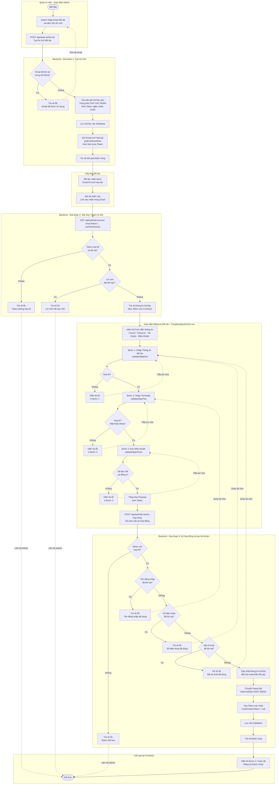

# Sơ đồ Activity Diagram - Chức năng Tạo Đối Tác

Dựa trên mã nguồn frontend (`TrangDangKyDoiTac.vue`) và backend (`QuanLyDoiTacService.java`, `DoiTacXacNhanController.java`), dưới đây là sơ đồ hoạt động chi tiết. Đây là quy trình **2 giai đoạn** với sự tham gia của **2 actor**: Quản trị viên (Admin) và Đối tác.

### Giải thích các điểm quan trọng:

1. **Quy trình 2 actor, 3 giai đoạn:**
   - **Admin** khởi tạo lời mời → **Hệ thống** gửi Email tự động → **Đối tác** nhận link và điền form.
   - Điều này đảm bảo chỉ những đối tác được **Admin duyệt** từ trước mới có thể đăng ký, tránh mở công khai tạo tài khoản tràn lan.

2. **Token bảo mật:**
   - Token là một chuỗi ngẫu nhiên (`UUID`) được tạo ra và lưu trong Database khi Admin gửi lời mời.
   - Token này được nhúng vào link Email. Khi Đối tác bấm link, Backend kiểm tra Token có tồn tại và còn hợp lệ không.
   - Sau khi Ký hợp đồng thành công, **Token bị xóa** (`confirmationToken = null`) để link trong Email không thể dùng lại được nữa.

3. **Form 3 bước (Stepper):**
   - Frontend chia quá trình điền thông tin thành 3 bước rõ ràng, mỗi bước có hàm `validate` riêng (`validateStepOne`, `validateStepTwo`, `validateStepThree`).
   - Ngay khi ấn Submit cuối cùng, Frontend còn validate lại cả 3 bước một lần nữa trước khi gửi API.

4. **Mã hóa mật khẩu:**
   - Mật khẩu đối tác được mã hóa bằng thuật toán `BCrypt` (`passwordEncoder.encode(...)`) trước khi lưu vào Database. Tuyệt đối không lưu mật khẩu dạng bản rõ.
