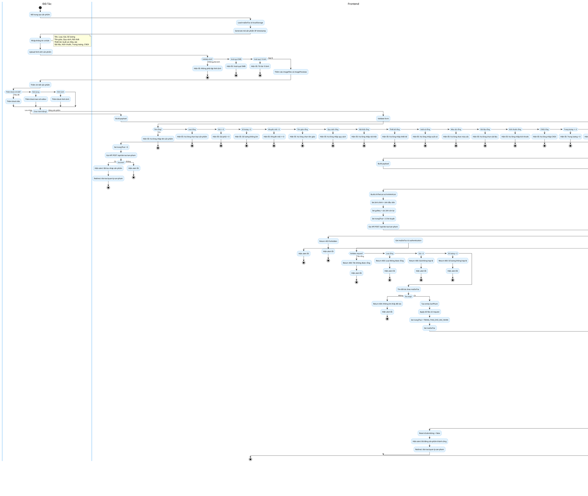

# Activity Diagram - Quy Trình Tạo Sản Phẩm

## Mermaid Activity Diagram

```mermaid
flowchart TD
    Start((Start)) --> OpenPage[Đối tác mở trang tạo sản phẩm]
    OpenPage --> LoadPartner[Load maDoiTac từ localStorage]
    LoadPartner --> GenerateMaSP[Generate mã sản phẩm SP-timestamp]
    GenerateMaSP --> InputBasic[Nhập thông tin cơ bản]
    
    InputBasic --> InputFields[Nhập: Tên, Loại, Giá, Số lượng, Tôn giáo, Quy cách, Nội thất, Thiết kế, Xuất xứ, Màu sắc, Vật liệu, Kích thước, Trọng lượng, CNSX]
    InputFields --> UploadImages[Upload hình ảnh sản phẩm]
    
    UploadImages --> ValidateImage{Validate ảnh}
    ValidateImage -->|Không phải ảnh| ShowErrorImg[Hiện lỗi: Không phải tệp hình ảnh]
    ShowErrorImg --> UploadImages
    ValidateImage -->|Vượt quá 5MB| ShowErrorSize[Hiện lỗi: Vượt quá 5MB]
    ShowErrorSize --> UploadImages
    ValidateImage -->|Vượt quá 10 ảnh| ShowErrorMax[Hiện lỗi: Tối đa 10 ảnh]
    ShowErrorMax --> UploadImages
    ValidateImage -->|Hợp lệ| AddImageFiles[Thêm vào imageFiles và imagePreviews]
    AddImageFiles --> AddDetails[Thêm chi tiết sản phẩm]
    
    AddDetails --> AddBlock{Thêm block chi tiết}
    AddBlock -->|Tiêu đề| AddTitle[Thêm block title]
    AddBlock -->|Nội dung| AddText[Thêm block text với editor]
    AddBlock -->|Hình ảnh| AddDetailImg[Thêm block hình ảnh]
    AddTitle --> AddBlock
    AddText --> AddBlock
    AddDetailImg --> AddBlock
    
    AddBlock -->|Hoàn tất| SelectAction{Chọn hành động}
    
    SelectAction -->|Lưu nháp| BuildPayloadDraft[Build payload]
    BuildPayloadDraft --> UploadGalleryDraft[Upload gallery images]
    UploadGalleryDraft --> UploadDetailDraft[Upload detail images]
    UploadDetailDraft --> CallAPIDraft[Gọi API POST /api/doi-tac/san-pham]
    
    SelectAction -->|Đăng sản phẩm| ValidateForm[Validate form]
    
    ValidateForm -->|Tên rỗng| ShowErrorName[Hiện lỗi: Vui lòng nhập tên sản phẩm]
    ShowErrorName --> InputBasic
    ValidateForm -->|Loại rỗng| ShowErrorType[Hiện lỗi: Vui lòng chọn loại sản phẩm]
    ShowErrorType --> InputBasic
    ValidateForm -->|Giá <= 0| ShowErrorPrice[Hiện lỗi: Giá phải > 0]
    ShowErrorPrice --> InputBasic
    ValidateForm -->|Số lượng < 0| ShowErrorQty[Hiện lỗi: Số lượng không âm]
    ShowErrorQty --> InputBasic
    ValidateForm -->|Khuyến mãi < 0| ShowErrorPromo[Hiện lỗi: Khuyến mãi >= 0]
    ShowErrorPromo --> InputBasic
    ValidateForm -->|Tôn giáo rỗng| ShowErrorReligion[Hiện lỗi: Vui lòng chọn tôn giáo]
    ShowErrorReligion --> InputBasic
    ValidateForm -->|Quy cách rỗng| ShowErrorSpec[Hiện lỗi: Vui lòng nhập quy cách]
    ShowErrorSpec --> InputBasic
    ValidateForm -->|Nội thất rỗng| ShowErrorInterior[Hiện lỗi: Vui lòng nhập nội thất]
    ShowErrorInterior --> InputBasic
    ValidateForm -->|Thiết kế rỗng| ShowErrorDesign[Hiện lỗi: Vui lòng nhập thiết kế]
    ShowErrorDesign --> InputBasic
    ValidateForm -->|Xuất xứ rỗng| ShowErrorOrigin[Hiện lỗi: Vui lòng nhập xuất xứ]
    ShowErrorOrigin --> InputBasic
    ValidateForm -->|Màu sắc rỗng| ShowErrorColor[Hiện lỗi: Vui lòng chọn màu sắc]
    ShowErrorColor --> InputBasic
    ValidateForm -->|Vật liệu rỗng| ShowErrorMaterial[Hiện lỗi: Vui lòng chọn vật liệu]
    ShowErrorMaterial --> InputBasic
    ValidateForm -->|Kích thước rỗng| ShowErrorSize[Hiện lỗi: Vui lòng nhập kích thước]
    ShowErrorSize --> InputBasic
    ValidateForm -->|CNSX rỗng| ShowErrorCNSX[Hiện lỗi: Vui lòng nhập CNSX]
    ShowErrorCNSX --> InputBasic
    ValidateForm -->|Trọng lượng <= 0| ShowErrorWeight[Hiện lỗi: Trọng lượng > 0]
    ShowErrorWeight --> InputBasic
    ValidateForm -->|Không có ảnh| ShowErrorNoImg[Hiện lỗi: Vui lòng tải ít nhất 1 ảnh]
    ShowErrorNoImg --> UploadImages
    
    ValidateForm -->|Hợp lệ| BuildPayload[Build payload]
    
    BuildPayload --> UploadGallery[Upload gallery images lên Cloudinary]
    UploadGallery --> UploadDetail[Upload detail images lên Cloudinary]
    UploadDetail --> BuildLists[Build chiTietList và hinhAnhList]
    
    BuildLists --> SetMainImage[Set ảnh chính = ảnh đầu tiên]
    SetMainImage --> SetGallery[Set gallery = các ảnh còn lại]
    SetGallery --> SetStatusPending[Set trangThai = 2 Chờ duyệt]
    SetStatusPending --> CallAPI[Gọi API POST /api/doi-tac/san-pham]
    
    CallAPI --> Backend{Backend xử lý}
    CallAPIDraft --> Backend
    
    Backend --> ValidateAuth{Validate authentication}
    ValidateAuth -->|Chưa đăng nhập| Return401[Return 401 Unauthorized]
    Return401 --> FrontendError
    
    ValidateAuth -->|Không phải đối tác| Return403[Return 403 Forbidden]
    Return403 --> FrontendError
    
    ValidateAuth -->|Hợp lệ| GetMaDT[Get maDoiTac từ authentication]
    GetMaDT --> ValidateRequest[Validate request]
    
    ValidateRequest -->|Tên rỗng| Return400Name[Return 400: Tên không được rỗng]
    Return400Name --> FrontendError
    ValidateRequest -->|Loại rỗng| Return400Type[Return 400: Loại không được rỗng]
    Return400Type --> FrontendError
    ValidateRequest -->|Giá < 0| Return400Price[Return 400: Giá không hợp lệ]
    Return400Price --> FrontendError
    ValidateRequest -->|Số lượng < 0| Return400Qty[Return 400: Số lượng không hợp lệ]
    Return400Qty --> FrontendError
    
    ValidateRequest -->|Hợp lệ| FindPartner[Tìm đối tác theo maDoiTac]
    FindPartner --> PartnerExists{Tìm thấy?}
    PartnerExists -->|Không| Return404[Return 404: Không tìm thấy đối tác]
    Return404 --> FrontendError
    
    PartnerExists -->|Có| CreateEntity[Tạo entity SanPham]
    CreateEntity --> ApplyData[Apply dữ liệu từ request]
    ApplyData --> SetStatus2[Set trangThai = TRANG_THAI_CHO_XAC_NHAN]
    SetStatus2 --> SetMaDT[Set maDoiTac]
    SetMaDT --> SaveProduct[Lưu sản phẩm vào database]
    
    SaveProduct --> SaveChiTiet[Lưu chi tiết sản phẩm vào sanphamchitiet]
    SaveChiTiet --> SaveImages[Lưu hình ảnh vào sanphamhinhanh]
    SaveImages --> CreateNotification[Tạo thông báo duyệt sản phẩm]
    
    CreateNotification --> SetNotifyTitle[Set tiêu đề: Duyệt sản phẩm mới]
    SetNotifyTitle --> SetNotifyContent[Set nội dung: Đối tác vừa thêm sản phẩm mới [MASP:id]]
    SetNotifyContent --> SetNotifyType[Set loaiThongBao = DUYET_SAN_PHAM]
    SetNotifyType --> SetNotifyBroadcast[Set nguoiNhanId = null broadcast]
    SetNotifyBroadcast --> SetNotifyMaSP[Set maSanPham]
    SetNotifyMaSP --> SetNotifyStatus[Set trangThai = 4 Chờ xác nhận]
    SetNotifyStatus --> SaveNotification[Lưu thông báo vào thongbao]
    SaveNotification --> ReturnSuccess[Return success + product info]
    
    ReturnSuccess --> FrontendSuccess{Frontend xử lý response}
    FrontendSuccess --> ResetSubmitting[Reset isSubmitting = false]
    ResetSubmitting --> ShowSuccessMsg[Hiện alert: Đã đăng sản phẩm thành công]
    ShowSuccessMsg --> RedirectQLSP[Redirect /doi-tac/quan-ly-san-pham]
    RedirectQLSP --> End((End))
    
    FrontendError --> ShowErrorMsg[Hiện alert lỗi từ backend]
    ShowErrorMsg --> ResetSubmitting
    ResetSubmitting --> End
    
    %% Swimlanes
    subgraph Doi_Tac
        OpenPage
        InputBasic
        UploadImages
        AddDetails
        SelectAction
    end
    
    subgraph Frontend
        LoadPartner
        GenerateMaSP
        InputFields
        ValidateImage
        AddImageFiles
        AddBlock
        AddTitle
        AddText
        AddDetailImg
        ValidateForm
        BuildPayload
        BuildPayloadDraft
        UploadGallery
        UploadGalleryDraft
        UploadDetail
        UploadDetailDraft
        BuildLists
        SetMainImage
        SetGallery
        SetStatusPending
        SetStatusDraft
        CallAPI
        CallAPIDraft
        FrontendSuccess
        FrontendError
        ResetSubmitting
        ShowSuccessMsg
        ShowErrorMsg
        RedirectQLSP
    end
    
    subgraph Backend
        Backend
        ValidateAuth
        GetMaDT
        ValidateRequest
        FindPartner
        CreateEntity
        ApplyData
        SetStatus2
        SetMaDT
        SaveProduct
        SaveChiTiet
        SaveImages
        CreateNotification
        SetNotifyTitle
        SetNotifyContent
        SetNotifyType
        SetNotifyBroadcast
        SetNotifyMaSP
        SetNotifyStatus
        SaveNotification
        ReturnSuccess
        Return401
        Return403
        Return404
        Return400Name
        Return400Type
        Return400Price
        Return400Qty
    end
    
    subgraph Cloudinary
        UploadGallery
        UploadGalleryDraft
        UploadDetail
        UploadDetailDraft
    end
    
    subgraph Database
        SaveProduct
        SaveChiTiet
        SaveImages
        SaveNotification
    end
    
    %% Styling
    classDef startend fill:#e1f5e1,stroke:#4caf50,stroke-width:2px
    classDef process fill:#e3f2fd,stroke:#2196f3,stroke-width:2px
    classDef decision fill:#fff3e0,stroke:#ff9800,stroke-width:2px
    classDef error fill:#ffebee,stroke:#f44336,stroke-width:2px
    classDef success fill:#f1f8e9,stroke:#8bc34a,stroke-width:2px
    classDef external fill:#f3e5f5,stroke:#9c27b0,stroke-width:2px
    
    class Start,End startend
    class LoadPartner,GenerateMaSP,InputFields,AddImageFiles,AddTitle,AddText,AddDetailImg,BuildPayload,BuildPayloadDraft,BuildLists,SetMainImage,SetGallery,SetStatusPending,SetStatusDraft,CallAPI,CallAPIDraft,FrontendSuccess,ResetSubmitting,ShowSuccessMsg,RedirectQLSP process
    class ValidateImage,AddBlock,SelectAction,ValidateForm,Backend,ValidateAuth,ValidateRequest,FindPartner,PartnerExists,FrontendSuccess decision
    class ShowErrorImg,ShowErrorSize,ShowErrorMax,ShowErrorName,ShowErrorType,ShowErrorPrice,ShowErrorQty,ShowErrorPromo,ShowErrorReligion,ShowErrorSpec,ShowErrorInterior,ShowErrorDesign,ShowErrorOrigin,ShowErrorColor,ShowErrorMaterial,ShowErrorSize,ShowErrorCNSX,ShowErrorNoImg,FrontendError,ShowErrorMsg,Return401,Return403,Return404,Return400Name,Return400Type,Return400Price,Return400Qty error
    class SaveProduct,SaveChiTiet,SaveImages,SaveNotification,ReturnSuccess success
    class UploadGallery,UploadGalleryDraft,UploadDetail,UploadDetailDraft external
```

## PlantUML Activity Diagram



## Mô Tả Quy Trình Tạo Sản Phẩm

### **Luồng Chính (Happy Path)**

**1. Frontend - User Input:**
- Đối tác mở trang tạo sản phẩm
- Load `maDoiTac` từ localStorage
- Generate mã sản phẩm: `SP-{timestamp}`
- Nhập thông tin cơ bản:
  - Tên sản phẩm (bắt buộc, max 120 ký tự)
  - Loại (Quan tài, Bình tro cốt, Tiểu quách, Hoa tang lễ, Vải liệm, Phụ kiện, Khác)
  - Giá bán (bắt buộc, > 0)
  - Số lượng (bắt buộc, >= 0, số nguyên)
  - Tôn giáo (Phật giáo, Công giáo, Tin lành, Cao Đài, Hòa Hảo, Không yêu cầu)
  - Quy cách (bắt buộc)
  - Nội thất (bắt buộc)
  - Thiết kế (bắt buộc)
  - Xuất xứ (bắt buộc)
  - Màu sắc (bắt buộc, có swatches mặc định + custom)
  - Vật liệu (Gỗ Vàng Tâm, Gỗ Dổi, Gỗ Gụ, Gỗ Pơ Mu, Gỗ Sồi, Gỗ Thông, Inox, Đá, Khác)
  - Kích thước (bắt buộc)
  - Trọng lượng (bắt buộc, > 0)
  - Công nghệ sản xuất (bắt buộc)
  - Khuyến mãi (tùy chọn, >= 0)
  - Ghi chú (tùy chọn)

**2. Frontend - Upload Images:**
- Upload hình ảnh sản phẩm (tối đa 10 ảnh, max 5MB mỗi ảnh)
- Validate: file type (image/*), file size (<= 5MB), count (<= 10)
- Thêm vào `imageFiles` và `imagePreviews`
- Hỗ trợ drag & drop

**3. Frontend - Add Details:**
- Thêm chi tiết sản phẩm với 3 loại block:
  - **Title:** Tiêu đề section
  - **Text:** Nội dung với rich text editor (bold, italic, link, etc.)
  - **Image:** Hình ảnh mô tả
- Có thể thêm/xóa block linh hoạt

**4. Frontend - Validate Form:**
- Validate tất cả fields (tên, loại, giá, số lượng, tôn giáo, quy cách, nội thất, thiết kế, xuất xứ, màu sắc, vật liệu, kích thước, trọng lượng, CNSX, khuyến mãi, ảnh)
- Nếu validation fail → Hiện lỗi, scroll đến field lỗi, **KHÔNG upload ảnh, KHÔNG gọi API**
- Nếu validation pass → Tiếp tục build payload

**5. Frontend - Build Payload:**
- Upload gallery images lên Cloudinary (`/api/upload`)
- Upload detail images lên Cloudinary
- Build `chiTietList` từ detail blocks:
  - `loaiKhoi`: TIEU_DE, NOI_DUNG, HINH_ANH
  - `noiDung`: nội dung hoặc URL ảnh
  - `thuTu`: thứ tự
- Build `hinhAnhList` từ gallery:
  - `loaiHinhAnh`: CHINH (ảnh đầu tiên), GALLERY (các ảnh còn lại)
  - `urlHinhAnh`: URL từ Cloudinary
  - `thuTu`: thứ tự
- Set `hinhAnh` = ảnh đầu tiên
- Set `trangThai` = 2 (Chờ duyệt)

**6. Backend - Create Product:**
- Validate authentication (đã đăng nhập, là đối tác)
- Get `maDoiTac` từ authentication
- Validate request (tên, loại, giá, số lượng không rỗng/hợp lệ)
- Nếu validation fail → throw exception, **KHÔNG lưu sản phẩm, KHÔNG lưu ảnh**
- Tìm đối tác theo `maDoiTac`
- Tạo entity `SanPham`
- Apply dữ liệu từ request
- Set `trangThai` = `TRANG_THAI_CHO_XAC_NHAN` (2)
- Set `maDoiTac`
- Lưu sản phẩm vào database

**7. Backend - Save Details:**
- Lưu chi tiết sản phẩm vào `sanphamchitiet`
- Lưu hình ảnh vào `sanphamhinhanh`

**8. Backend - Create Notification:**
- Tạo thông báo duyệt sản phẩm
- `tieuDe`: "Duyệt sản phẩm mới"
- `noiDung`: "Đối tác {tenDoiTac} vừa thêm sản phẩm mới: {tenSanPham}. [MASP:{maSanPham}]"
- `loaiThongBao`: "DUYET_SAN_PHAM"
- `nguoiNhanId`: null (broadcast cho tất cả nhân viên)
- `maSanPham`: ID sản phẩm
- `trangThai`: 4 (Chờ xác nhận)
- Lưu thông báo vào `thongbao`

**9. Frontend - Success:**
- Reset `isSubmitting = false`
- Hiện alert: "Đã đăng sản phẩm thành công"
- Redirect về `/doi-tac/quan-ly-san-pham`

### **Luồng Lưu Nháp**

- User chọn "Lưu nháp"
- Set `trangThai` = 0 (Ẩn)
- Build payload và upload ảnh
- Gọi API POST
- Hiện alert: "Đã lưu nháp sản phẩm"
- Redirect về trang quản lý sản phẩm

### **Luồng Exception**

**Frontend Validation:**
- Tên rỗng → Hiện lỗi
- Loại rỗng → Hiện lỗi
- Giá <= 0 → Hiện lỗi
- Số lượng < 0 → Hiện lỗi
- Khuyến mãi < 0 → Hiện lỗi
- Tôn giáo rỗng → Hiện lỗi
- Quy cách rỗng → Hiện lỗi
- Nội thất rỗng → Hiện lỗi
- Thiết kế rỗng → Hiện lỗi
- Xuất xứ rỗng → Hiện lỗi
- Màu sắc rỗng → Hiện lỗi
- Vật liệu rỗng → Hiện lỗi
- Kích thước rỗng → Hiện lỗi
- CNSX rỗng → Hiện lỗi
- Trọng lượng <= 0 → Hiện lỗi
- Không có ảnh → Hiện lỗi

**Image Validation:**
- Không phải ảnh → Hiện lỗi
- Vượt quá 5MB → Hiện lỗi
- Vượt quá 10 ảnh → Hiện lỗi

**Backend Validation:**
- Chưa đăng nhập → Return 401
- Không phải đối tác → Return 403
- Tên rỗng → Return 400
- Loại rỗng → Return 400
- Giá < 0 → Return 400
- Số lượng < 0 → Return 400
- Không tìm thấy đối tác → Return 404

### **Trạng Thái Sản Phẩm**

| Mã | Trạng Thái | Mô Tả |
|----|-----------|-------|
| 0 | Ẩn | Nháp, không hiển thị |
| 1 | Đang bán | Đã duyệt, hiển thị trên website |
| 2 | Chờ duyệt | Đối tác vừa tạo/sửa, chờ admin duyệt |
| 3 | Từ chối duyệt | Admin từ chối, cần sửa lại |

### **Thông Báo Duyệt Sản Phẩm**

- **Loại thông báo:** `DUYET_SAN_PHAM`
- **Người nhận:** Broadcast (tất cả nhân viên)
- **Nội dung:** "Đối tác {tenDoiTac} vừa thêm sản phẩm mới: {tenSanPham}. [MASP:{maSanPham}]"
- **Trạng thái:** 4 (Chờ xác nhận)
- **Admin có thể:** Duyệt hoặc từ chối sản phẩm

### **Cloudinary Upload**

- **Endpoint:** `/api/upload`
- **Method:** POST
- **Content-Type:** multipart/form-data
- **Field name:** "file"
- **Max file size:** 5MB
- **Supported types:** image/*
- **Response:** URL ảnh

### **Database Tables**

1. **sanpham:** Thông tin sản phẩm chính
2. **sanphamchitiet:** Chi tiết mô tả (tiêu đề, nội dung, hình ảnh)
3. **sanphamhinhanh:** Hình ảnh sản phẩm (chính, gallery)
4. **thongbao:** Thông báo duyệt sản phẩm
5. **doitac:** Thông tin đối tác
