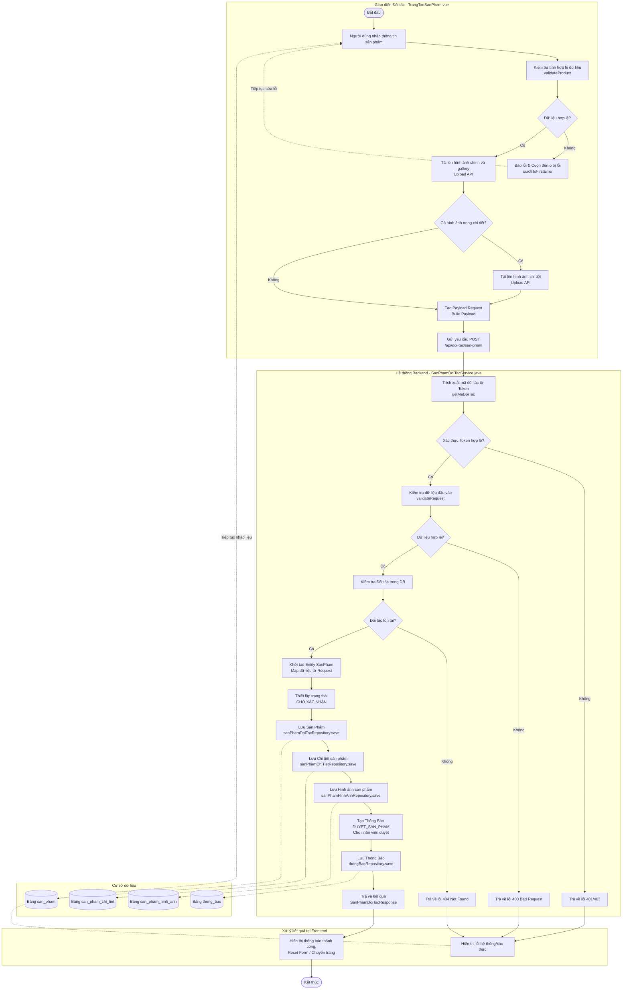

# Sơ đồ Activity Diagram - Chức năng Tạo Sản Phẩm của Đối Tác

Dựa trên mã nguồn frontend (`TrangTaoSanPham.vue`) và backend (`SanPhamDoiTacService.java`), dưới đây là sơ đồ hoạt động (Activity Diagram) chi tiết cho luồng tạo sản phẩm mới của đối tác:

### Giải thích các bước quan trọng:

1. **Frontend**: 
   - Trước khi upload ảnh hay gửi API, hệ thống chạy hàm `validateProduct()` để kiểm tra các trường bắt buộc (tên, giá tiền > 0, số lượng không âm, tôn giáo, màu sắc...). Nếu lỗi sẽ hiển thị cảnh báo đỏ và tự động cuộn màn hình tới ô bị lỗi.
   - Đối tác cần upload ảnh lên server trước qua API `/api/upload` để lấy URL ảnh, sau đó mới tổng hợp URL ảnh vào Payload.
   - Có 2 loại ảnh cần upload: Ảnh gallery (ảnh sản phẩm) và ảnh nằm trong nội dung mô tả chi tiết.
   
2. **Backend**:
   - Backend lấy ID đối tác trực tiếp từ Token bảo mật (đảm bảo tính toàn vẹn, đối tác này không thể tạo sản phẩm cho đối tác khác).
   - **Quy tắc nghiệp vụ quan trọng**: Khi đối tác tạo sản phẩm, sản phẩm không được bán ngay mà bắt buộc gán `trangThai = TRANG_THAI_CHO_XAC_NHAN`.
   - Một thông báo loại `DUYET_SAN_PHAM` được sinh ra tự động gửi cho nhân viên quản trị để họ vào kiểm tra và duyệt sản phẩm này.
   - Dữ liệu được lưu vào 3 bảng chính về sản phẩm: `san_pham`, `san_pham_chi_tiet`, `san_pham_hinh_anh` và 1 bảng `thong_bao`.
